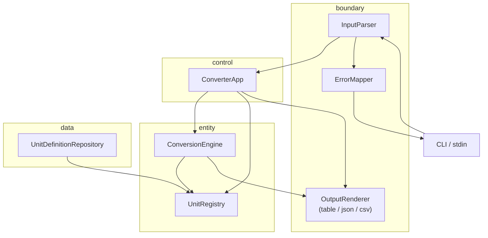

# UnitConvertor_06

**meter 허브 기준 길이 단위 변환 CLI** — Python·클린 아키텍처 학습자가 계약·테스트·BCE 레이어로 정확한 환산과 확장(단위·포맷·설정)을 검증 가능하게 익히기 위한 프로젝트입니다.

## 목차

- [개요 (Overview)](#개요-overview)
- [빠른 시작 (Quick Start)](#빠른-시작-quick-start)
- [지원 단위 및 비율](#지원-단위-및-비율)
- [입력 형식 계약](#입력-형식-계약)
- [아키텍처](#아키텍처)
- [테스트 실행](#테스트-실행)
- [설정 파일 (JSON/YAML)](#설정-파일-jsonyaml)
- [출력 포맷](#출력-포맷)
- [기여 가이드 (Contributing)](#기여-가이드-contributing)
- [라이선스](#라이선스)
- [To-Do 리스트 — UnitConverter (Python)](#to-do-리스트--unitconverter-python)

---

## 개요 (Overview)

### 이 프로젝트가 해결하는 문제

단일 스크립트에 입출력·환산·비율이 한곳에 모이면, **음수·형식 오류·미등록 단위**를 일관되게 거부하기 어렵고, AI 보조 코딩 시 **반올림·오류 문구·비율**이 조용히 바뀌어도 회귀를 눈으로만 확인하게 됩니다. 이 저장소는 `단위:값` 한 줄 입력으로 **등록된 모든 길이 단위**로 환산하되, 거부·출력·비율을 **측정 가능한 계약**으로 고정하는 것을 목표로 합니다.

### 주요 학습 목표

| 주제 | 학습 내용 |
|------|-----------|
| **OCP / SRP** | 새 단위·출력 포맷 추가 시 Engine 시그니처·환산식 변경 최소화 |
| **BCE** | `entity` / `control` / `boundary` / `data` 분리 및 의존성 방향 준수 |
| **TDD** | RED → GREEN → refactor; exact message·ε·앵커 TC로 회귀 보호 |

### PRD와의 연결

기능·계약·인수 기준의 **단일 기준 문서**는 [docs/PRD.md](docs/PRD.md)입니다. README는 실행·기여 관점 요약이며, 수치·오류 문구·스키마 변경 시 PRD를 먼저 갱신합니다.

---

## 빠른 시작 (Quick Start)

### 사전 조건

| 항목 | 요구 |
|------|------|
| Python | **3.11+** |
| 패키지 관리 | `venv` 권장 |
| 개발 도구 | `pytest`, `pytest-cov` (테스트); `black`, `isort` (포맷, 선택) |

### 빌드 & 실행

```bash
# 가상환경 생성·활성화 (Windows)
python -m venv venv
venv\Scripts\activate

# 의존성 설치 (pyproject.toml 또는 requirements.txt가 있는 경우)
pip install -e ".[dev]"

# 실행 (레거시 진입점 — BCE 구조 완성 후 boundary/cli_adapter 권장)
python UnitConverter.py
```

```bash
# macOS / Linux
python3 -m venv venv
source venv/bin/activate
python UnitConverter.py
```

프롬프트에 `단위:값` 형식으로 입력합니다 (예: `meter:5.0`).

### 예시 입출력

**입력**

```text
meter:5.0
```

**출력 (table, 기본 — 표시값 1자리 ROUND_HALF_UP)**

```text
5.0 meter = 5.0 meter
5.0 meter = 16.4 feet
5.0 meter = 5.5 yard
```

> 내부 계산: feet = 5.0 × 3.28084 = 16.4042 → **16.4**; yard = 5.0 × 1.09361 = 5.46805 → **5.5**

---

## 지원 단위 및 비율

앵커 단위는 **meter**입니다. 모든 환산은 `meters_per_unit`(1 단위 = N meter)로 정규화합니다.

| 단위명 | 식별자 (`unit_id`) | meter 기준 비율 (`meters_per_unit`) | 출처 / 등가 |
|--------|-------------------|-------------------------------------|-------------|
| meter | `meter` | `1.0` | 앵커 (PRD §5.1) |
| feet | `feet` | `0.3048` | 1 m = 3.28084 ft |
| yard | `yard` | `0.9144` | 1 m = 1.09361 yd |

**환산식:** `target = source × (mpu(source) / mpu(target))`  
**내부 검증 허용 오차:** ε = `1e-4` (절대 오차)

동적 등록·설정 파일로 **추가 단위**를 넣을 수 있습니다 ([설정 파일](#설정-파일-jsonyaml), [PRD §5.3](docs/PRD.md)).

---

## 입력 형식 계약

명령 판별 순서: **등록 패턴(`=` + `meter`)** → **변환(`:`)** → 그 외 형식 오류.

### 정상 예시

| 유형 | 입력 예시 | 설명 |
|------|-----------|------|
| 변환 | `meter:2.5` | 기본 3단위 전체 출력 |
| 변환 | `feet:8.2` | 비앵커 입력, meter 경유 환산 |
| 등록 | `1 cubit = 0.4572 meter` | 세션 Registry에 cubit 추가 |

### 비정상 예시 (에러 메시지 exact)

| 입력 예시 | code | message (stdout, exact) |
|-----------|------|-------------------------|
| `meter 2.5` (콜론 없음) | `ERR_INVALID_FORMAT` | `Invalid format. Use unit:value (ex: meter:2.5)` |
| `mile:1` (미등록) | `ERR_UNKNOWN_UNIT` | `Unknown unit: mile` |
| `meter:-1` (음수) | `ERR_NEGATIVE_VALUE` | `Value must be zero or positive: -1` |

실패 시 **exit code ≠ 0**. 빈 입력: `Input is empty.` (`ERR_EMPTY_INPUT`).

상세 제약: [PRD §3.3](docs/PRD.md).

---

## 아키텍처

### BCE 레이어 (Mermaid)



### 의존성 방향

| 허용 | 금지 |
|------|------|
| `boundary` → `control` → `entity` | `entity` → `boundary` |
| `data` → `entity` | `entity` → `control` |
| `boundary` → `entity` (읽기 전용 조합 시) | `entity` → `data` |

- **entity:** 환산식·Registry만 (I/O·print·파일 없음)
- **boundary:** 파싱·렌더·고정 오류 문구 (비율 하드코딩 없음)
- **data:** `config/units.json` 로드
- **control:** 유스케이스 오케스트레이션

### 새 단위 추가 (코드 변경 최소화)

| 방법 | 단계 | Engine 수정 |
|------|------|-------------|
| **설정 파일** | 1) `config/units.json`에 `{ "id", "meters_per_unit" }` 추가 2) 앱 재시작 | **불필요** |
| **런타임 등록** | 1) `1 myunit = 0.5 meter` 입력 2) `myunit:10` 등 변환 | **불필요** |
| **새 출력 포맷** | 1) `OutputRenderer` 구현체 추가 2) boundary에서 선택 | **불필요** |

설계 상세: [docs/bce/BCE-design.md](docs/bce/BCE-design.md).

---

## 테스트 실행

| 항목 | 값 |
|------|-----|
| 프레임워크 | **pytest** |
| 커버리지 | **pytest-cov** |
| 패턴 | AAA (Arrange–Act–Assert) |

```bash
# 전체 테스트
pytest

# 커버리지 (레이어별 목표는 PRD §4.3)
pytest --cov=entity --cov=boundary --cov=control --cov=data --cov-report=term-missing
```

### 커버리지 목표

| 레이어 | line | branch |
|--------|------|--------|
| entity | ≥ 95% | ≥ 90% |
| boundary | ≥ 90% | ≥ 85% |
| data | ≥ 85% | ≥ 80% |

RED 목록·앵커 TC: [docs/testing/RED-test-list.md](docs/testing/RED-test-list.md).

---

## 설정 파일 (JSON/YAML)

### 위치 및 JSON 형식

**경로:** `config/units.json` (기본)

```json
{
  "units": [
    { "id": "meter", "meters_per_unit": 1.0 },
    { "id": "feet", "meters_per_unit": 0.3048 },
    { "id": "yard", "meters_per_unit": 0.9144 }
  ]
}
```

**YAML (선택):** `config/units.yaml` — 키 구조는 JSON과 동일.

| 오류 조건 | code |
|-----------|------|
| 파일 없음 | `CFG_FILE_NOT_FOUND` |
| JSON/YAML 파싱 실패 | `CFG_PARSE_ERROR` |

로드 실패 시 **환산 결과를 출력하지 않습니다.**

### 동적 단위 등록 (CLI)

```text
1 cubit = 0.4572 meter
```

**성공 메시지 (exact):** `Registered: 1 cubit = 0.4572 meter`

이후 `meter:1` 입력 시 **4줄** 출력(cubit 포함). 계약: [PRD §5.3](docs/PRD.md).

---

## 출력 포맷

기본값: **table**. 표시값은 **소수 1자리 ROUND_HALF_UP**; `source_value`는 입력 magnitude 그대로.

### 콘솔 (table)

```text
2.5 meter = 2.5 meter
2.5 meter = 8.2 feet
2.5 meter = 2.7 yard
```

### JSON

```json
{
  "source": { "unit": "meter", "value": 2.5 },
  "conversions": [
    { "unit": "meter", "value": 2.5 },
    { "unit": "feet", "value": 8.2 },
    { "unit": "yard", "value": 2.7 }
  ]
}
```

### CSV

```csv
source_unit,source_value,target_unit,target_value
meter,2.5,meter,2.5
meter,2.5,feet,8.2
meter,2.5,yard,2.7
```

| format | 필수 여부 |
|--------|-----------|
| table | **필수** |
| json | 권장 |
| csv | 권장 |

---

## 기여 가이드 (Contributing)

### 계약 변경 금지 원칙

- [PRD](docs/PRD.md)의 **오류 message exact**, **Background 비율**, **표시 반올림(1자리)** 를 테스트 없이 바꾸지 않습니다.
- 변경이 필요하면 **RED 테스트 추가 → GREEN → 문서(PRD·Gherkin·RED 목록) 동시 갱신** 순서를 따릅니다.
- 회귀 앵커 `A-01`, `A-03`, `A-06`, `T-01`, `J-01`, `C-01` 삭제·assert 완화는 허용하지 않습니다.

### 테스트 없는 PR

| 정책 | 내용 |
|------|------|
| 거부 | 동작·계약 변경에 대응하는 pytest 없음 |
| 거부 | `skip` / `xfail`로 실패 테스트만 통과시키는 PR |
| 요구 | 레이어 커버리지 목표 미달 시 테스트 보강 또는 범위 명시 |

### 커밋 메시지 컨벤션

```text
<type>(<scope>): <subject>

<body: what / why, test IDs if any>
```

| type | 용도 |
|------|------|
| `feat` | 기능 (boundary, entity, …) |
| `fix` | 버그 (계약 준수) |
| `test` | RED / GREEN / 회귀 TC |
| `refactor` | GREEN 이후 구조만 |
| `docs` | PRD, README, Gherkin |

**scope 예:** `entity`, `boundary`, `data`, `control`, `docs`

`.cursorrules`의 `forbidden`·`tdd_rules`를 준수합니다.

---

## 라이선스

**MIT License** — 학습·실습 목적으로 자유롭게 사용·수정·배포할 수 있습니다. 상업 이용 시에도 MIT 조건(저작권 표시)을 유지합니다.

---

## 관련 문서

| 문서 | 설명 |
|------|------|
| [docs/PRD.md](docs/PRD.md) | 제품 요구사항 (계약·인수 기준) |
| [docs/requirements-package.md](docs/requirements-package.md) | Epic / Journey / Gherkin |
| [docs/bce/BCE-design.md](docs/bce/BCE-design.md) | BCE 설계 |
| [docs/testing/RED-test-list.md](docs/testing/RED-test-list.md) | RED 테스트 목록 |

---

# To-Do 리스트 — UnitConverter (Python)

> 기준: [docs/PRD.md](docs/PRD.md) §3 기능 요구사항 · §7.1 인수 기준 · §7.2 회귀 보호  
> **통과 정의:** 아래 “완료 기준”을 담당 역할이 검증하고, pytest·리뷰 로그로 확인할 때 Done.

| 역할 | 책임 |
|------|------|
| **학습자(구현)** | RED/GREEN/refactor, 레이어 코드·테스트 작성 |
| **리뷰어** | PRD 계약·forbidden·의존성 방향 준수 확인 |
| **CI** | `pytest`·`pytest-cov` 자동 실행, 임계값 게이트 |

---

## 🔴 필수 (Must-Have) — v1.0 릴리스 차단 항목

- [ ] **entity: UnitRegistry 기본 3단위 + meter 앵커 환산** | PRD F-03, §5.1, G-02 | **학습자:** `with_defaults()` 및 `convert` 구현 후 **CI:** A-01,A-03,A-04 pytest GREEN; ε≤1e-4
- [ ] **entity: 음수·0·미등록 단위 거부** | PRD F-02, §3.3, US-01 | **학습자:** Domain 예외 발생 **리뷰어:** boundary 매핑 전 entity 단독 TC(N-01,U-01) GREEN
- [ ] **boundary: `unit:value` 파싱·table 렌더** | PRD F-01, F-04, AC-01 | **학습자:** `meter:2.5` → stdout 3줄 exact **CI:** T-01, A-06 앵커 GREEN; exit 0
- [ ] **boundary: 고정 오류 문구 5종 exact** | PRD F-02, §3.2, AC-02, AC-03 | **학습자:** `meter 2.5`/`mile:1` 메시지 일치 **리뷰어:** 문자열 diff 0; exit ≠0
- [ ] **표시 반올림 1자리 ROUND_HALF_UP** | PRD §3.3, §6.1, G-02 | **학습자:** `2.5 meter = 8.2 feet`, `2.7 yard` **CI:** A-06,T-04 통과
- [ ] **control: 변환 유스케이스 오케스트레이션** | PRD §4.2, F-01 | **학습자:** boundary→control→entity 연결 **리뷰어:** entity→boundary import 0건
- [ ] **통합: Happy path + 형식/unknown unit** | PRD AC-01~03, S-01,S-02 | **CI:** T-I-01~05(또는 동등 시나리오) GREEN **학습자:** 수동 `python` 1회는 보조만
- [ ] **RED P0 전부 GREEN (필수 분류)** | PRD G-01, SC-01 | **CI:** 파싱·정확도·table·음수·unknown RED ID P*,N*,U*,A-01~03,T-01 0 failed
- [ ] **pyproject·tests/ 레이아웃·pytest 실행 가능** | PRD §4.1, README Quick Start | **학습자:** `pytest` 로컬 exit 0 **CI:** 워크플로 또는 문서화된 명령 동일

---

## 🟡 권장 (Should-Have) — 품질 향상 항목

- [ ] **data: config/units.json 로드 → Registry** | PRD F-06, §5.2, US-05 | **학습자:** 유효 JSON 3단위 **CI:** T-DA-01, A-07 GREEN; entity/boundary에 `open` 없음
- [ ] **data: CFG_FILE_NOT_FOUND / CFG_PARSE_ERROR** | PRD F-06, AC-04 | **학습자:** malformed·누락 시 환산 stdout 0줄 **CI:** 통합 TC exit ≠0, code assert
- [ ] **boundary: JSON 출력 스키마** | PRD F-05, §6.2, US-04 | **학습자:** `source`+`conversions[]` 1자리 **CI:** J-01~J-04 GREEN
- [ ] **boundary: CSV 출력 스키마** | PRD F-05, §6.3 | **학습자:** 헤더 4열·N행 **CI:** C-01~C-04 GREEN
- [ ] **동적 단위 등록 CLI** | PRD F-07, §5.3, AC-05, G-04 | **학습자:** `1 cubit = 0.4572 meter` 후 4줄 **CI:** R-01,T-I-03 GREEN; MSG_REGISTER_OK exact
- [ ] **레이어 커버리지 목표 달성** | PRD §4.3, AC-06, G-03 | **CI:** entity line≥95%, boundary≥90%, data≥85% 리포트 첨부 **리뷰어:** 미달 시 PR reject
- [ ] **BCE refactor (GREEN 이후)** | PRD RR-04, §4.2 | **학습자:** `UnitConverter.py` → boundary/control/entity/data 분리 **CI:** refactor 전후 pytest diff 0 failed
- [ ] **pydantic DTO (Command·ErrorEnvelope·units)** | PRD §4.1 | **학습자:** 설정·명령 검증 **리뷰어:** 공개 API 타입 힌트 100%

---

## 🟢 선택 (Nice-to-Have) — v2.0 후보

- [ ] **units.yaml 로드 (JSON 동형)** | PRD F-08 | **기대 가치:** 설정 형식 선택지 확대, Data 소스 OCP 검증
- [ ] **format CLI 플래그 (`--format=json|csv|table`)** | PRD F-05 | **기대 가치:** 스크립트·CI 파이프 연동 편의
- [ ] **import-linter / 의존성 자동 검사** | PRD G-05, SC-05 | **기대 가치:** entity 역참조 PR 단계 차단
- [ ] **Gherkin pytest-bdd 실행** | Phase 4 Gherkin | **기대 가치:** AC-01~04를 비개발자 readable 시나리오로 재실행
- [ ] **등록 단위 영속 save (재시작 후 유지)** | PRD §5.2 확장 | **기대 가치:** 실습 외 로컬 운영 시나리오

---

## 🔵 기술 부채 (Tech Debt)

- [ ] **단일 파일 `UnitConverter.py`에 I/O·환산·비율 혼재** | 원인: 레거시 실습 시작 코드 | **해결:** M2 refactor로 entity/boundary 분리; RR-04 준수
- [ ] **비율이 README·PRD·코드 3곳에 분산 위험** | 원인: 초기 하드코딩 | **해결:** `config/units.json` 단일 출처 + entity만 참조
- [ ] **문서(PRD) vs 구현 계약 드리프트** | 원인: AI 생성 코드 병합 | **해결:** 계약 변경 시 RED→PRD→README 동시 PR (RR-02, RR-03)
- [ ] **앵커 TC 미구현 상태 가능** | 원인: RED 지연 | **해결:** v1.0 전 A-01,A-03,A-06,T-01,J-01,C-01 최우선 GREEN (RR-01)

---

## ✅ 완료 항목 (Done)

- [x] **Phase 5 PRD 작성** (`docs/PRD.md`) | 2026-05-20 | `docs: add PRD UC-06-001`
- [x] **README 오픈소스 문서화 (계약·아키텍처·기여)** | 2026-05-20 | `docs: README from PRD`
- [x] **Phase 4 요구사항 패키지·RED 목록·BCE 설계 문서** | 2026-05-20 | `docs: requirements, RED, BCE`
- [x] **`.cursorrules` (tdd·architecture·forbidden)`** | 2026-05-20 | `chore: cursorrules BCE TDD`

---

## 📋 회귀 방지 체크리스트 (PRD §7.2)

**배포·v1.0 태그 전 — CI 또는 릴리스 담당자가 전항 체크**

| # | 확인 항목 | 담당 | 통과 조건 |
|---|-----------|------|-----------|
| R-1 | 계약 테스트 | CI | `pytest` 0 failed; AC-01~03 message exact |
| R-2 | 앵커 TC | 리뷰어 | A-01,A-03,A-06,T-01,J-01,C-01 존재·GREEN |
| R-3 | 커버리지 | CI | entity≥95% / boundary≥90% / data≥85% line |
| R-4 | 회귀 규칙 RR-01~05 | 리뷰어 | skip/xfail 위장 0; refactor PR에 GREEN 로그 |
| R-5 | README·PRD 동기화 | 문서 담당 | 비율·오류문구·예시 입출력 diff 없음 |
| R-6 | forbidden 준수 | 리뷰어 | 매직넘버 boundary 없음; entity I/O 없음 |
| R-7 | 비율·반올림 변경 시 | PR 작성자 | PRD+Gherkin+RED 동시 커밋 (RR-03) |

---

## 🗓️ 마일스톤

| 마일스톤 | 포함 항목 (PRD) | 목표일 | 상태 | 통과 책임 |
|----------|-----------------|--------|------|-----------|
| **M0 — 문서·계약 고정** | PRD, README, RED, Gherkin, .cursorrules | 2026-05-20 | ✅ Done | 문서 담당 |
| **M1 — v1.0 Core** | F-01~F-04, F-02, F-03; AC-01~03; G-01,G-02,G-05 | T+2일 (실습 2h) | 🔴 진행 전 | 학습자 + CI |
| **M2 — v1.0 Quality** | F-05~F-07; F-06; AC-04~06; G-03,G-04; refactor | T+4일 (실습 4h) | ⏳ 대기 | 학습자 + 리뷰어 |
| **M3 — v1.0 Release** | Must 전부 + 회귀 체크리스트 R-1~R7 | T+5일 | ⏳ 대기 | CI + 릴리스 담당 |
| **M4 — v2.0 후보** | F-08, Nice-to-Have | 미정 | 📋 백로그 | 팀 합의 |
