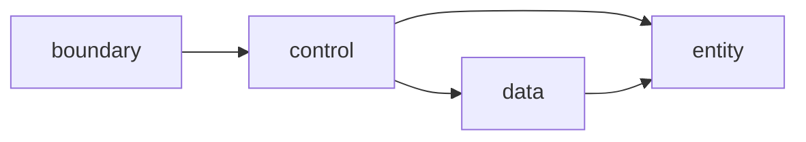

# 01 — UnitConvertor_06 Phase 5 명세·문서화 작업 보고서

| 항목 | 내용 |
|------|------|
| 문서 번호 | 01 |
| 프로젝트 | UnitConvertor_06 (Python 길이 단위 변환 학습 시스템) |
| 작업 기간 | 2026-05-20 |
| 기준 PRD | [docs/PRD.md](../docs/PRD.md) (PRD-UC-06-001) |
| 브랜치 | `spec` |
| 작성 | AI 보조 문서화 세션 (구현 코드 미포함) |

---

## 1. Executive Summary

Phase 5에서는 **구현 없이** 요구사항·설계·테스트 명세·프로젝트 가이드를 정리했다. meter 허브 기준 길이 변환 CLI의 **계약(입력·오류·출력)·BCE 레이어·TDD RED 목록·인수 기준**을 문서로 고정했으며, README·`.cursorrules`·To-Do·회귀 체크리스트까지 한 저장소에서 추적 가능하게 맞췄다.

**다음 단계:** README To-Do의 🔴 Must-Have(M1 v1.0 Core) — entity/boundary RED→GREEN.

---

## 2. 작업 범위 및 산출물

### 2.1 완료 산출물

| 구분 | 산출물 | PRD 연계 |
|------|--------|----------|
| 문제 정의 | Observation / Why / Invariant / 사고능력 (대화 산출) | §1.2 배경 |
| Mom Test | `docs/mom-test/Mom-Test-questions.md` | 사용자 검증 |
| BCE 설계 | `docs/bce/BCE-design.md`, `DOCS/bce/BCE-design.md` | §4.2 아키텍처 |
| RED 목록 | `docs/testing/RED-test-list.md`, `DOCS/testing/RED-test-list.md` | G-01, SC-01 |
| Phase 4 패키지 | `docs/requirements-package.md` | Epic / Journey / Gherkin |
| Phase 5 PRD | `docs/PRD.md` | §3~§7 전체 |
| 오픈소스 README | `README.md` (Quick Start, 아키텍처, To-Do) | 운영·기여 |
| Cursor 규칙 | `.cursorrules` (tdd, architecture, forbidden 등) | §4.1~4.4 |
| DOCS 인덱스 | `DOCS/README.md` | 문서 허브 |

### 2.2 의도적 미포함 (Non-Goal)

| 항목 | PRD 근거 |
|------|----------|
| `entity/` / `boundary/` / `control/` / `data/` 구현 | NG-02 외 — CLI 학습 범위만 |
| `pytest` 테스트 파일 | RED **목록**만; GREEN 미착수 |
| `config/units.json` 실파일 | 계약만 정의 (F-06 권장) |
| GUI·웹 | NG-02 |

---

## 3. PRD 대비 달성 현황

### 3.1 기능 요구사항 (F-01~F-08)

| ID | 우선순위 | 문서화 상태 | 구현 상태 |
|----|----------|-------------|-----------|
| F-01 | 필수 | 계약 완료 (PRD §3.2) | 미구현 |
| F-02 | 필수 | 오류 문구 exact 고정 | 미구현 |
| F-03 | 필수 | D-INV-03~05, §5.1 | 레거시 `UnitConverter.py` 부분 |
| F-04 | 필수 | table 스키마 §6.1 | 레거시 부분 |
| F-05 | 권장 | JSON/CSV §6.2~6.3 | 미구현 |
| F-06 | 권장 | `config/units.json` 스키마 | 미구현 |
| F-07 | 권장 | §5.3 동적 등록 | 미구현 |
| F-08 | 선택 | YAML 동형 명시 | 미구현 |

### 3.2 인수 기준 (AC-01~AC-06)

| AC | 설명 | 문서 | 테스트/구현 |
|----|------|------|-------------|
| AC-01 | `meter:2.5` table 3줄, 8.2/2.7 | PRD §7.1, Gherkin | RED T-01, A-06 — 미GREEN |
| AC-02 | invalid format exact | PRD §3.2 | P-04 — 미GREEN |
| AC-03 | unknown unit exact | PRD §3.2 | U-03 — 미GREEN |
| AC-04 | CFG_PARSE_ERROR | PRD §3.2 | T-DA-06 — 미GREEN |
| AC-05 | cubit 등록 4줄 | PRD §5.3 | R-01, T-I-03 — 미GREEN |
| AC-06 | coverage 임계값 | PRD §4.3 | CI 미구성 |

**통과 주체:** 학습자가 M1~M3 마일스톤 완료 시 `pytest` + `pytest-cov`로 검증.

### 3.3 회귀 보호 (RR-01~RR-05)

| 규칙 | 문서 반영 | 검증 준비 |
|------|-----------|-----------|
| RR-01 | RED 앵커 A-01,A-03,A-06,T-01,J-01,C-01 명시 | 목록만 |
| RR-02 | PRD·README exact message | — |
| RR-03 | Background 비율 고정 표 | — |
| RR-04 | `.cursorrules` tdd refactor | — |
| RR-05 | RED→GREEN 순서 | — |

---

## 4. 아키텍처·계약 요약 (구현 착수용)

### 4.1 레이어·의존성

- **금지:** entity → boundary / control / data
- **앵커:** meter; `meters_per_unit`: meter 1.0, feet 0.3048, yard 0.9144
- **표시:** 1자리 ROUND_HALF_UP (예: 2.5m → 8.2ft)

### 4.2 핵심 오류 문구 (변경 시 RR-02)

| code | message (exact) |
|------|-----------------|
| ERR_INVALID_FORMAT | `Invalid format. Use unit:value (ex: meter:2.5)` |
| ERR_UNKNOWN_UNIT | `Unknown unit: {unit}` |
| ERR_NEGATIVE_VALUE | `Value must be zero or positive: {value}` |

---

## 5. 테스트·품질 계획

| 항목 | 수치/내용 |
|------|-----------|
| RED 테스트 (명세) | 41건 (`docs/testing/RED-test-list.md`) |
| DOCS RED (대안 명세) | 38건 (`DOCS/testing/RED-test-list.md`) |
| Coverage 목표 | entity line ≥95%, boundary ≥90%, data ≥85% |
| 회귀 앵커 | A-01, A-03, A-06, T-01, J-01, C-01 |

**권장 RED 순서:** A → N → U → R → P → T/J/C → Integration.

---

## 6. 리스크·이슈

| # | 리스크 | 영향 | 완화 |
|---|--------|------|------|
| R-1 | 레거시 `UnitConverter.py` 단일 파일 | BCE 분리 지연 | M2 refactor; RR-04 |
| R-2 | `docs/` vs `DOCS/` 이중 트리 | 기준 문서 혼선 | `DOCS/` 기준; `docs/README` 안내 |
| R-3 | PRD negative 문구 vs 초기 BCE `non-negative` | exact match 불일치 | PRD·README 기준 통일 |
| R-4 | `UnitConverter.cpp` 삭제(staged 아님) | 브랜치 이력 | git commit 시 의도 명시 |
| R-5 | 구현 없이 AC 전부 미충족 | v1.0 미릴리스 | M1 Must-Have 착수 |

---

## 7. 마일스톤·To-Do 연계

| 마일스톤 | 상태 | PRD 기능 | 담당 |
|----------|------|----------|------|
| M0 문서·계약 | ✅ 완료 | — | 문서 세션 |
| M1 v1.0 Core | 🔴 대기 | F-01~F-04, F-02, AC-01~03 | 학습자 + CI |
| M2 Quality | ⏳ | F-05~F-07, AC-04~06 | 학습자 + 리뷰어 |
| M3 Release | ⏳ | 회귀 R-1~R-7 | CI + 릴리스 |

상세 체크리스트: [README.md — To-Do](../README.md#to-do-리스트--unitconverter-python).

---

## 8. Git·저장소 반영 (예정)

| 변경 유형 | 경로 예시 |
|-----------|-----------|
| 추가 | `docs/`, `DOCS/`, `.cursorrules`, `README.md`, `Report/`, `prompting/` |
| 수정 | `README.md` (신규/대체) |
| 삭제 | `UnitConverter.cpp` (git tracked) |

**원격:** `origin` → `https://github.com/yuldakim/UnitConvertor_06.git`  
**푸시 후:** PR 또는 `spec` 브랜치 머지 검토.

---

## 9. 결론 및 권고

1. **문서 기준선 확보 완료** — PRD를 단일 진실 공급원(Single Source of Truth)으로 유지한다.  
2. **구현은 M1부터** — entity RED(T-D/A/N) → boundary exact message → integration T-I-01.  
3. **계약 변경 시** — RED 추가 → PRD·README·Gherkin 동시 갱신(RR-03).  
4. **Mom Test** — 가정 A~C 검증 후 동적 등록(F-07) 우선순위 재조정 가능.

---

## 10. 승인·검토 (체크박스)

- [ ] PRD §7.1 인수 기준 검토자 확인
- [ ] README To-Do Must-Have 담당자 할당
- [ ] 회귀 앵커 TC 리포지토리 반영 계획
- [ ] Git push 후 CI(pytest) 도입 일정

---

*본 보고서는 코드 구현 없이 명세·문서화 Phase만을 다룬다.*
