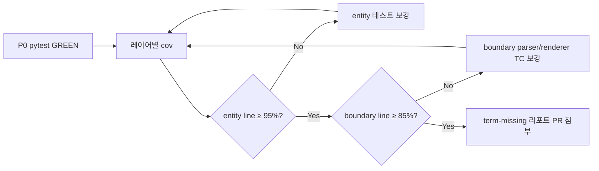

# 테스트 계획서 — meter → feet 변환 (샘플 시나리오)

| 항목 | 값 |
|------|-----|
| 문서 ID | TP-UC-06-001 |
| 기준 PRD | [PRD.md](PRD.md) F-01, F-02, F-03, F-04, AC-01~03, G-02, S-01 |
| 기준 README | 예시 입출력, 입력 형식 계약, 출력 포맷(table), Must-Have |
| 샘플 기능 | **meter 입력 → 기본 3단위 table 환산** (대표: **meter → feet**, `meter:2.5`) |
| 스택 | Python 3.11+, pytest, pytest-cov, pydantic v2 |
| 아키텍처 | BCE Dual-Track (`entity` / `boundary` / `control` / `data`) |
| 작성 관점 | 시니어 QA 리드 — v1.0 Core(M1) 범위 |

---

## 1. 테스트 목적·범위

### 1.1 목적

- README·PRD에 고정된 **비율**(1 m = 3.28084 ft, 1 m = 1.09361 yd)과 **표시 계약**(1자리 `ROUND_HALF_UP`)이 회귀 없이 유지되는지 검증한다.
- 샘플 Happy path `meter:2.5`를 중심으로 **Domain(내부 수치)** 과 **Boundary(파싱·table·오류 문구)** 를 분리 측정한다.

### 1.2 In-Scope (본 계획서)

| 영역 | 포함 |
|------|------|
| 변환 | `meter:{value}` → registry 전 단위 환산, **feet 라인** 집중 + meter/yard 동시 검증 |
| 출력 | table 기본 포맷, stdout 줄 패턴·개수·exit code |
| 검증 | F-02 입력 거부(형식·숫자·음수·미등록 단위) |
| 도구 | pytest 단위·통합, pytest-cov 레이어별 커버리지 |

### 1.3 Out-of-Scope (M2 이후 별도 TP)

- JSON/CSV 포맷(J-*, C-*), `config/units.json`(T-DA-*), 동적 등록(F-07), Gherkin pytest-bdd 실행

---

## 2. 샘플 기준 계약 (Golden Reference)

### 2.1 Happy path

| 항목 | 값 |
|------|-----|
| 입력 | `meter:2.5` |
| exit code | `0` |
| stdout (table, 3줄 exact) | 아래와 동일 |

```text
2.5 meter = 2.5 meter
2.5 meter = 8.2 feet
2.5 meter = 2.7 yard
```

### 2.2 이중 검증 기준 (Dual-Track)

| Track | 레이어 | meter → feet 검증 |
|-------|--------|-------------------|
| **Logic** | `entity` | `2.5 × 3.28084 ≈ 8.2021`, 절대 오차 ε ≤ `1e-4` (PRD §3.3, G-02) |
| **UI** | `boundary` | stdout 라인 `2.5 meter = 8.2 feet` **exact string** (A-06, T-01) |

### 2.3 추적 ID (회귀 앵커)

| ID | 역할 |
|----|------|
| A-01 | 1 meter → feet 내부 `3.28084` (ε) |
| A-06 | `2.5 meter` → feet 표시 `8.2` (ROUND_HALF_UP) |
| T-01 | `meter:2.5` table 3줄·패턴 |
| T-I-01 | 통합: stdin `meter:2.5` → 위 3줄 |

---

## 3. pytest 단위 테스트 범위·우선순위

### 3.1 디렉터리·레이어 (목표 구조)

```
tests/
├── entity/          # Domain — Registry, Engine, Quantity, invariants
├── boundary/        # Parser, table renderer, error mapper
├── control/         # ConverterApp 오케스트레이션 (P1)
├── data/            # (M2) config 로드
└── integration/     # end-to-end stdin/stdout (P0 일부)
```

### 3.2 우선순위 정의

| 우선순위 | 시기 | 범위 | 통과 조건 |
|----------|------|------|-----------|
| **P0** | RED → GREEN (M1 차단) | 샘플 Happy path + §4 경계값 전부 + AC-01~03 | `pytest` 0 failed; 앵커 TC 삭제·skip/xfail 0건 |
| **P1** | M1 완료 직후 | `control` wiring, `feet:8.2` 역환산, 빈 입력 | line 커버리지 게이트 충족 |
| **P2** | M2 | json/csv, config, 동적 등록 | 별도 테스트 계획 개정 |

### 3.3 P0 — `tests/entity/` (Logic Track)

| # | Test-ID (권장) | 대상 | 시나리오 | Assert |
|---|----------------|------|----------|--------|
| E-01 | A-01 | `ConversionEngine` + defaults registry | `meter:1` → feet magnitude | ≈ `3.28084`, ε ≤ `1e-4` |
| E-02 | T-D-01 | 동일 | `meter:2.5` → feet 내부 | ≈ `8.2021`, ε ≤ `1e-4` |
| E-03 | T-D-02 | 동일 | `meter:2.5` → yard 내부 | ≈ `2.734025`, ε ≤ `1e-4` |
| E-04 | N-01 | `LengthQuantity` / Registry | `meter:-1` | `NegativeMagnitudeError` (또는 동등 도메인 예외) |
| E-05 | N-02 | 동일 | `meter:0` | 예외 없음; feet = `0.0` |
| E-06 | U-01 | Registry | `parsec` 미등록 조회 | `UnknownUnitError` (환산 미수행) |
| E-07 | — | Engine | `meter:1e100` (매우 큰 수) | 유한 float이면 환산 성공; `inf`/`nan`이면 거부 정책 문서화 후 assert |

**금지:** `input()`, `print`, 파일 I/O, boundary import.

### 3.4 P0 — `tests/boundary/` (UI Track)

| # | Test-ID (권장) | 대상 | 시나리오 | Assert |
|---|----------------|------|----------|--------|
| B-01 | T-01 | Parser + table renderer (Engine **Fake/Mock**) | `meter:2.5` | stdout 3줄; `2.5 meter = 8.2 feet` substring **exact line** |
| B-02 | A-06 | table renderer | `2.5` → feet 표시만 | `8.2` (HALF_UP 1자리) |
| B-03 | P-04 | Parser | `meter 2.5` (`:` 없음) | code `ERR_INVALID_FORMAT`; message exact |
| B-04 | P-05 | Parser | `meter:abc` | code `ERR_INVALID_NUMBER`; message `Invalid number: abc` |
| B-05 | P-02 | Parser | `meter:-1` | code `ERR_NEGATIVE_VALUE`; message `Value must be zero or positive: -1` |
| B-06 | U-03 | Parser + error mapper | `parsec:1.0` | code `ERR_UNKNOWN_UNIT`; message `Unknown unit: parsec` |
| B-07 | — | Parser | `meter:0` | `ConvertCommand(meter, 0.0)`; table에 `0.0 meter = 0.0 feet` |
| B-08 | — | Parser | `""` (빈 줄) | `ERR_EMPTY_INPUT`; `Input is empty.` |

**원칙:** Boundary 테스트는 **환산 비율 하드코딩 없음**; Engine은 주입.

### 3.5 P0 — `tests/integration/`

| # | Test-ID | 시나리오 | Assert |
|---|---------|----------|--------|
| I-01 | T-I-01 | defaults registry + CLI/table 파이프, stdin `meter:2.5` | §2.1 stdout 3줄; exit `0` |
| I-02 | AC-02 | stdin `meter 2.5` | §4.4 message; exit ≠ `0` |
| I-03 | AC-03 | stdin `parsec:1.0` | §4.6 message; exit ≠ `0`; 환산 stdout **0줄** |

### 3.6 실행 순서 (Dual-Track TDD)

1. **RED:** E-01~E-06, B-01~B-08 (의도적 실패)
2. **GREEN:** entity → boundary → integration (`.cursorrules` green_phase)
3. **Refactor:** 전 GREEN 후 구조 분리; **assert·문구·수치 불변** (RR-04)

---

## 4. 경계값 케이스 목록

### 4.1 요약 매트릭스

| # | 입력 | 분류 | 기대 (요약) | 주 담당 레이어 | Test-ID |
|---|------|------|-------------|----------------|---------|
| BV-01 | `meter:0` | 영값 변환 | exit `0`; `0.0 meter = 0.0 feet` (및 3줄) | entity E-05, boundary B-07, integration | N-02 |
| BV-02 | `meter:1e308` 또는 `meter:999999999999999` | 매우 큰 수 | float 유한 범위 내 환산 또는 명시적 거부; **오버플로로 inf 출력 금지**(품질 기준) | entity E-07 | — |
| BV-03 | `meter:-1` | 음수 정책 | 거부; `ERR_NEGATIVE_VALUE`; exit ≠ `0` | entity E-04, boundary B-05 | N-01 |
| BV-04 | `meter:abc` | 소수 파싱 실패 | `ERR_INVALID_NUMBER`; `Invalid number: abc` | boundary B-04 | P-05 |
| BV-05 | `meter 2.5` | `:` 없음 (형식 오류) | `ERR_INVALID_FORMAT`; PRD exact message | boundary B-03, integration I-02 | P-04, AC-02 |
| BV-06 | `parsec:1.0` | 없는 단위 | `ERR_UNKNOWN_UNIT`; `Unknown unit: parsec`; 환산 없음 | entity E-06, boundary B-06, integration I-03 | U-03 |

> PRD AC-03 예시는 `mile:1`이나, 본 계획서는 요청 샘플 **`parsec:1.0`** 을 동일 계약(U-03)으로 검증한다.

### 4.2 케이스 상세

#### BV-01 — value = 0 (영값 변환)

| 항목 | 내용 |
|------|------|
| 입력 | `meter:0` |
| 정책 | PRD §3.3: magnitude `< 0` 거부, **`0` 허용** |
| entity | feet = `0.0`, yard = `0.0` (ε 불필요) |
| boundary | `0.0 meter = 0.0 feet` (source_value 반올림 없음) |
| exit | `0` |

#### BV-02 — value = 매우 큰 수 (오버플로 위험)

| 항목 | 내용 |
|------|------|
| 입력 (권장 2건) | `meter:1e100`, `meter:1e308` (Python `float` 상한 근접) |
| 위험 | `float` → `inf`, 표시 `inf` 노출, silent precision loss |
| 기대 (v1.0) | ① 유한 결과면 ε 검증 또는 상대 오차 상한 명시 ② `inf`/`nan` 발생 시 **실패 처리**(예외 또는 `ERR_INVALID_NUMBER`) — 구현 전 RED에 기대값 고정 |
| QA 메모 | IEEE double 한계 내에서만 “성공”; 그 외는 **거부가 안전** |

#### BV-03 — value < 0 (음수 입력 정책)

| 항목 | 내용 |
|------|------|
| 입력 | `meter:-1` |
| message (exact) | `Value must be zero or positive: -1` |
| stdout | 환산 줄 **0줄** |
| exit | ≠ `0` |

#### BV-04 — 소수점 파싱 실패 (`meter:abc`)

| 항목 | 내용 |
|------|------|
| 입력 | `meter:abc` |
| code | `ERR_INVALID_NUMBER` |
| message (exact) | `Invalid number: abc` |
| 선행 조건 | `:` 1회 분리 성공 후 numeric parse 단계에서 실패 |

#### BV-05 — `:` 없는 입력 (형식 오류)

| 항목 | 내용 |
|------|------|
| 입력 | `meter 2.5` |
| code | `ERR_INVALID_FORMAT` |
| message (exact) | `Invalid format. Use unit:value (ex: meter:2.5)` |
| exit | ≠ `0` |

#### BV-06 — 없는 단위 (`parsec:1.0`)

| 항목 | 내용 |
|------|------|
| 입력 | `parsec:1.0` |
| code | `ERR_UNKNOWN_UNIT` |
| message (exact) | `Unknown unit: parsec` |
| entity | Registry에 `parsec` 없음 → 환산 호출 전 거부 |
| boundary | 동일 message를 stdout에 출력 |

### 4.3 샘플 `meter:2.5`와의 관계

| 케이스 | `meter:2.5` Happy path와의 관계 |
|--------|--------------------------------|
| BV-01~03 | 동일 파서·동일 Engine 경로의 **값 경계** |
| BV-04~05 | Happy path **이전** 파싱 단계 실패 |
| BV-06 | 파싱 성공 후 **Registry 조회** 실패 |

---

## 5. 예외·특이 케이스 목록

| # | ID | 케이스 | 입력/조건 | 기대 |
|---|-----|--------|-----------|------|
| EX-01 | P-03 | 다중 `:` | `meter:2:5` | `ERR_INVALID_FORMAT` (콜론 1회 규칙) |
| EX-02 | — | 빈 입력 | `""` / whitespace only | `ERR_EMPTY_INPUT`; `Input is empty.` |
| EX-03 | — | 빈 unit_id | `:2.5` | `ERR_INVALID_FORMAT` 또는 `ERR_UNKNOWN_UNIT` (파서 규칙 RED에 고정) |
| EX-04 | — | 표시 반올림 경계 | `meter:2.55` → feet | `8.4` (8.375 → HALF_UP) — A-06 보강 |
| EX-05 | — | 비앵커 입력 | `feet:8.2` | meter 경유; table 3줄; feet 라인 표시 일관 |
| EX-06 | — | 명령 우선순위 | `1 x = 1.0 meter` vs `meter:2.5` | `=` 포함 시 **등록** 패턴 우선 (F-07, M2) |
| EX-07 | RR | skip/xfail | 임의 실패 테스트 | **금지** — PR reject |
| EX-08 | RR | 앵커 삭제 | A-01, A-06, T-01 제거·assert 완화 | **금지** (RR-01) |

---

## 6. 커버리지 목표

### 6.1 본 계획서 게이트 (요청 기준)

| 레이어 (Domain/UI) | 패키지 | line | branch | 비고 |
|--------------------|--------|------|--------|------|
| **Domain** | `entity` | **≥ 95%** | ≥ 90% (PRD/README) | Engine, Registry, Quantity |
| **Boundary (UI)** | `boundary` | **≥ 85%** | ≥ 85% | Parser, renderer, error_mapper |
| Control | `control` | ≥ 80% (권장) | — | M1 P1 |
| Data | `data` | M2: ≥ 85% | — | 본 TP Out-of-Scope |

> README·PRD AC-06는 boundary **line ≥ 90%** 를 명시한다. **릴리스 게이트:** 본 문서 85% **최소선** + README 90% **목표선** 동시 추적.

### 6.2 샘플 시나리오별 “반드시 실행된” 모듈

| 모듈 | 최소 커버 대상 |
|------|----------------|
| `entity/engine.py` | `convert`, `meter:2.5`, `meter:0`, `meter:-1` |
| `entity/registry.py` | defaults 3단위, unknown unit |
| `boundary/parser.py` | `meter:2.5`, `meter:abc`, `meter 2.5`, `parsec:1.0` |
| `boundary/renderers/table.py` | 3줄 패턴, HALF_UP |
| `boundary/errors.py` | 5종 ERR_* exact mapping |

---

## 7. pytest-cov 측정 전략

### 7.1 설치

```bash
python -m venv venv
venv\Scripts\activate          # Windows
# source venv/bin/activate     # macOS/Linux

pip install -e ".[dev]"        # pyproject.toml dev extra 권장
# 또는 최소:
pip install pytest pytest-cov pydantic
```

### 7.2 실행 명령 (BCE 레이어 — 권장)

프로젝트 구현 레이아웃(`entity`, `boundary`, `control`, `data`) 기준:

```bash
pytest \
  --cov=entity \
  --cov=boundary \
  --cov=control \
  --cov-report=term-missing \
  --cov-report=html:htmlcov \
  -v
```

**게이트 예시 (line만):**

```bash
pytest --cov=entity --cov=boundary --cov-report=term-missing \
  --cov-fail-under=0
# CI에서 entity ≥95, boundary ≥85 는 리포트 파싱 또는 pyproject [tool.coverage.report] fail_under 분리 권장
```

### 7.3 실행 명령 (`unit_converter` 패키지명 — 별칭)

단일 패키지로 묶은 경우(메타 패키지 또는 `src/unit_converter`):

```bash
pip install pytest-cov

pytest --cov=unit_converter --cov-report=term-missing -v
```

| 상황 | 사용 |
|------|------|
| BCE 디렉터리 구현 | §7.2 `--cov=entity --cov=boundary` |
| 레거시 단일 모듈 `UnitConverter.py`만 존재 | `--cov=UnitConverter` 또는 모듈명에 맞게 조정 |
| 통합 패키지 `unit_converter` | §7.3 |

### 7.4 측정 절차 (QA 워크플로)



1. **기능 게이트:** P0 전부 GREEN (`pytest` exit 0).
2. **커버리지 수집:** §7.2 실행 → `term-missing`에서 미커버 라인 확인.
3. **보강 우선순위:** `entity/engine.py` → `boundary/parser.py` → `table` renderer.
4. **PR 산출물:** 터미널 요약 + `htmlcov/index.html` (선택).
5. **회귀:** 앵커 TC(A-01, A-06, T-01) 포함 전체 스위트 재실행.

### 7.5 `term-missing` 해석 가이드

| Miss 유형 | 조치 |
|-----------|------|
| 오류 분기 미실행 | §4 BV-03~06, §5 EX 케이스 추가 |
| renderer 포맷 분기 | table만 P0; json/csv는 M2 |
| defensive branch | dead code 여부 리뷰; 불필요 시 제거( refactor 단계) |

---

## 8. 테스트 데이터·Fixture

| Fixture | 용도 |
|---------|------|
| `defaults_registry` | meter/feet/yard, MPU 1.0 / 0.3048 / 0.9144 |
| `fake_conversion_engine` | boundary — 고정 `ConversionBatch` 주입 |
| `capsys` | integration/boundary stdout exact |
| `epsilon` | `1e-4` (entity 수치 assert) |

---

## 9. 완료 기준 (Exit Criteria)

| # | 조건 |
|---|------|
| 1 | AC-01: `meter:2.5` → §2.1 stdout, exit `0` |
| 2 | AC-02, AC-03: BV-05, BV-06 message exact, exit ≠ `0` |
| 3 | §4 경계값 BV-01~06 entity/boundary TC 존재·GREEN |
| 4 | 앵커 A-01, A-06, T-01 삭제·약화 0건 (RR-01) |
| 5 | `entity` line ≥ **95%**, `boundary` line ≥ **85%** (`term-missing` 증빙) |
| 6 | skip/xfail 위장 0건 (RR-05) |

---

## 10. 문서 추적

| 변경 시 동시 갱신 |
|-------------------|
| [PRD.md](PRD.md) §3.2~3.3, §7.1 |
| [README.md](../README.md) 예시 입출력·Must-Have |
| RED 목록 (`docs/testing/RED-test-list.md` — 생성 시) |
| 본 문서 `TP-UC-06-001` 버전 |

| 버전 | 일자 | 변경 |
|------|------|------|
| 1.0 | 2026-05-21 | 최초 작성 — 샘플 `meter:2.5` / meter→feet 기준 |
