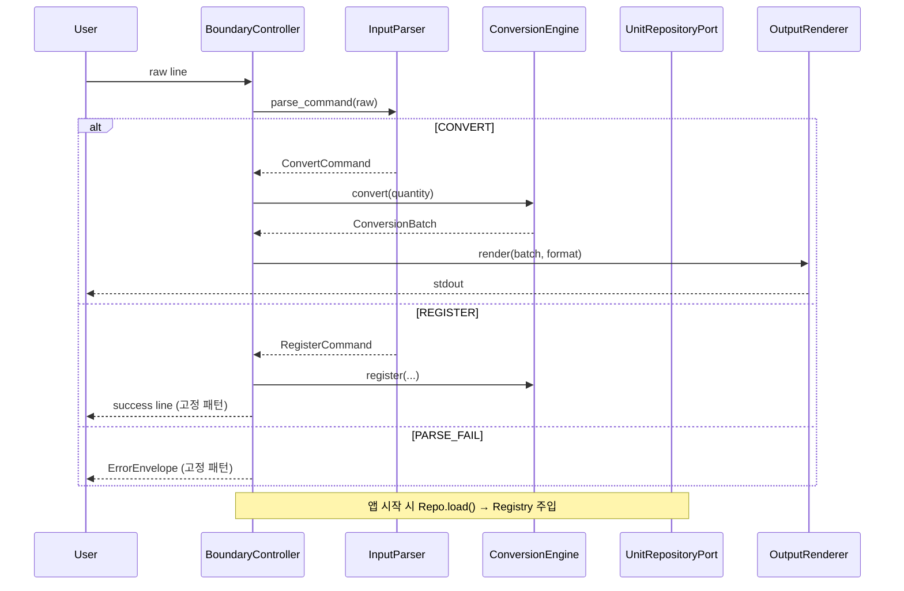
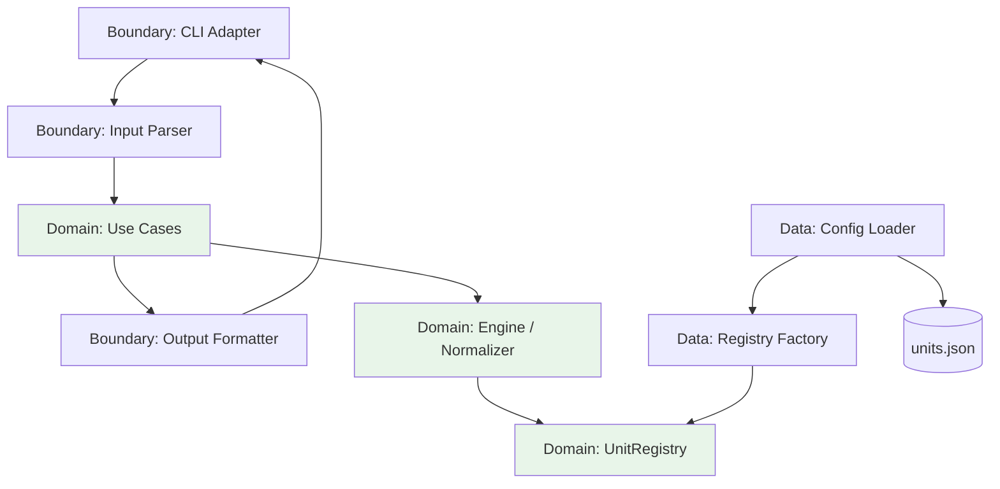

# Export Transcript — UnitConvertor_06

Exported: 2026-05-20 21:27

---

## Turn 1 — user

<user_query>
🔲 문제 정의 전문가 — Python
당신은 문제 정의 전문가입니다.
워크스페이스: @c:\DEV_BR\UnitConvertor_06\ 
⚠️ 코드 작성·클래스 설계·알고리즘·빌드 스크립트는 하지 마십시오.

다시 처음부터 할게 이전 내용은 잊고 지금부터 다시시작하자
STEP 1 — Observation
1) 지금 우리가 해결하려는 "상황"을 한 문단으로 관찰 관점에서 서술하라.
2) 왜 길이(meter/feet/yard) 변환 문제를 다루는가?
3) OCP/SRP, 입력 검증, 설정 외부화, 동적 단위 등록, 출력 포맷과 연결해
   이 문제가 어떤 학습 맥락에서 등장하는가?

STEP 2 — Why #1: 정확한 변환 결과가 왜 중요한가?
STEP 3 — Why #2: 수동 계산이 아닌 프로그램(+테스트)인 이유?
STEP 4 — Why #3: 계약을 먼저 고정하려는 이유?

STEP 5 — 문제 정의
1) 표면 문제 1~2문장
2) 개선된 정의 3~7문장
3) 핵심 Invariant 5개 이내 (측정·검증 가능한 문장)
4) 훈련하려는 사고 능력 3개

출력: 구조화된 Markdown만. 코드·파일 경로 금지.
</user_query>

---

## Turn 2 — assistant

워크스페이스 맥락을 파악한 뒤, 요청하신 구조로 문제 정의만 작성합니다.

[REDACTED]

---

## Turn 3 — assistant

# 문제 정의 — 길이 단위 변환기 (Python)

---

## STEP 1 — Observation

### 1) 상황 관찰 (한 문단)

사용자가 `단위:숫자` 형태로 길이를 한 번 입력하면, 지원하는 모든 길이 단위로 환산한 결과를 일관된 형식으로 보여 주는 작은 콘솔 프로그램을 만들려 한다. 초기에는 meter·feet·yard 세 단위와 고정된 환산 비율이 전제이며, 이후에는 비율을 코드 밖 설정으로 옮기고, 런타임에 새 단위를 등록하며, JSON·CSV·표 등 출력 방식을 고를 수 있게 확장한다. 동시에 잘못된 입력·음수·미지원 단위는 거절하고, 설계는 확장에 열려 있으면서 각 책임은 분리되며, 변환 정확성은 자동화된 테스트로 증명하려는 실습 맥락이다.

### 2) 왜 길이(meter / feet / yard) 변환인가?

- **도메인이 단순하고 비율이 명확**해 “변환이 맞는지”를 사람이 검산하기 쉽다.
- **동일 물리량(길이)의 선형 스케일**이라, 단위 추가·설정 외부화·동적 등록을 **작은 범위**에서 연습할 수 있다.
- **실무와 가깝다**: 국제 단위·현지 단위 혼용, 설정 기반 환율/계수, 포맷별 리포팅은 작은 도구에서도 반복되는 패턴이다.

### 3) 학습 맥락과의 연결

| 요구·개념 | 이 문제에서의 역할 |
|-----------|-------------------|
| **OCP** | 새 단위·출력 포맷·설정 소스를 넣을 때 기존 변환·검증 흐름을 최소 수정 |
| **SRP** | 입력 파싱, 검증, 환산, 포맷팅, 설정 로드, 단위 등록을 서로 다른 변경 이유로 분리 |
| **입력 검증** | 신뢰할 수 있는 출력의 전제; 잘못된 계약은 조용한 오답으로 이어짐 |
| **설정 외부화** | 비율·단위 정의를 코드 재배포 없이 바꾸는 운영·실험 습관 |
| **동적 단위 등록** | 고정 enum이 아닌 **확장 가능한 모델** 설계 연습 |
| **출력 포맷** | 동일 결과를 **다른 소비자**(사람·스크립트·스프레드시트)에 맞게 표현 |

이 과제는 **6시간 규모의 생성형 AI 활용 실습** 안에서, 기본 기능 → 품질 요구 → 테스트 → 확장 요구 → 회고 순으로 **설계·테스트·리팩토링**을 한 번에 경험하도록 배치된 학습용 문제다.

---

## STEP 2 — Why #1: 정확한 변환 결과가 왜 중요한가?

- 길이 환산 오류는 **누적·전파**된다(한 단위만 틀려도 나머지 출력 전체가 틀림).
- 사용자는 **계산기를 신뢰**하고 수동 검산을 생략한다; 작은 반올림·비율 오류도 “도구 버그”로 인식된다.
- feet·yard는 meter 기준 **파생 비율**이므로, 기준 정의가 어긋나면 **단위 간 일관성(왕복 변환)**이 깨진다.
- 실습 목표는 “돌아가는 UI”가 아니라 **측정 가능한 정확성**이므로, 기대값이 문서화된 비율과 맞는지가 성공 기준이다.

---

## STEP 3 — Why #2: 수동 계산이 아닌 프로그램(+테스트)인 이유?

- 단위가 늘고 포맷·설정·동적 등록이 붙으면 **수동 검산 비용**이 기하급수적으로 커진다.
- 프로그램은 **동일 규칙을 반복** 적용해 사람의 실수·피로를 줄인다.
- 테스트는 “지금 맞다”가 아니라 **리팩토링·요구 추가 후에도 맞다**는 회귀 방지망이다.
- 입력 검증·엣지 케이스는 테스트 없이는 **재현·설명**이 어렵다.
- AI 보조 코딩 환경에서는 **테스트가 사실상의 스펙**이 되어, 생성 코드의 검증 루프를 닫는다.

---

## STEP 4 — Why #3: 계약을 먼저 고정하려는 이유?

- **입력 형식**, **지원 단위**, **비율 출처**, **반올림·표시 규칙**, **오류 시 동작**이 모호하면 구현과 테스트가 엇갈린다.
- 계약을 먼저 쓰면 OCP/SRP 논의가 “클래스 이름”이 아니라 **변경 가능한 경계**로 내려온다.
- RED·Mom Test·BCE 같은 산출물은 **관찰 가능한 행위**로 계약을 고정하는 수단이다.
- 확장 요구(설정 파일, 동적 등록, 출력 포맷)는 **계약이 없으면** 기존 기능을 깨뜨리기 쉽다.
- 팀·AI·미래의 자신이 **같은 기대**를 공유하는 단일 기준점이 된다.

---

## STEP 5 — 문제 정의

### 1) 표면 문제 (1~2문장)

사용자가 입력한 길이를 meter·feet·yard 등 지원 단위로 바꿔 출력하는 프로그램을 만든다. 새 단위와 출력 방식을 붙여도 기존 로직 변경을 줄이고, 변환과 입력 처리는 테스트로 검증한다.

### 2) 개선된 정의 (3~7문장)

**길이 변환 도메인**에서, 사용자는 `기준단위:양` 한 줄로 값을 제출하고, 시스템은 등록된 모든 길이 단위에 대한 환산 결과를 선택한 형식으로 돌려준다. 환산 계수는 코드 상수에 묶지 않고 설정·동적 등록으로 확장 가능해야 하며, meter를 기준으로 한 파생 비율의 일관성을 유지한다. 잘못된 형식, 음수, 알 수 없는 단위는 명확히 실패하고, 성공 경로만 결과를 낸다. 구조는 단위·포맷·설정 소스가 늘어날 때 **기존 변환 규칙과 검증 로직을 건드리지 않고** 확장되도록 책임을 나눈다. 정확성과 회귀 방지는 자동화 테스트로 증명하며, 실습자는 AI를 활용해 구현하되 **계약·테스트를 먼저** 두는 습관을 익힌다.

### 3) 핵심 Invariant (5개 이내, 측정·검증 가능)

1. **기준 비율**: 문서에 정한 `1 meter = 3.28084 feet`, `1 meter = 1.09361 yard`를 사용한 환산 결과가 테스트 허용 오차 내에서 일치한다.
2. **일관성**: 임의의 유효 입력에 대해, A→B→A 왕복(또는 meter 경유) 시 원래 값과 **정의된 반올림 규칙** 하에서 일치한다.
3. **완전 출력**: 유효 입력이면 **현재 등록된 모든 길이 단위**에 대해 누락 없이 한 줄(또는 선택 포맷의 한 레코드)씩 결과가 있다.
4. **거부**: 음수, 파싱 불가 형식, 미등록 단위 입력 시 **결과 환산을 수행하지 않고** 정의된 오류 표현만 반환한다.
5. **확장 무파괴**: 설정에 단위를 추가하거나 런타임 등록·출력 포맷을 바꾼 뒤에도, 기존에 통과하던 **기본 세 단위·기본 포맷** 테스트가 깨지지 않는다.

### 4) 훈련하려는 사고 능력 (3개)

1. **계약 우선 사고**: 관찰·Why·Invariant로 “무엇이 맞는지”를 고정한 뒤 구현·AI 프롬프트에 들어가기.
2. **경계 설계 사고**: 변경 이유별로 책임을 나누고, 확장점(OCP)과 검증·설정·표현의 분리(SRP)를 의도적으로 선택하기.
3. **증거 기반 품질 사고**: 테스트를 부가물이 아니라 **정확성·회귀·리팩토링 안전망**으로 두고, 요구 추가 시 테스트를 먼저 갱신하는 습관 갖기.

---

[REDACTED]

---

## Turn 4 — user

<user_query>
🔲 Mom Test 질문
@c:\DEV_BR\UnitConvertor_06\ 프로젝트를 "고객 인터뷰" 관점에서 준비한다.
제품이 아니라 학습자/사용자의 행동을 드러내는 Mom Test 질문 10개.
각 질문: (1) 과거 구체 경험 (2) 실제 행동 (3) 돈/시간/리스크 연결.
금지: 기능 나열형 질문만으로 끝내기.
마지막에 "진짜 위험 가정" 3개를 bullet로.
구현·코드 금지.
</user_query>

---

## Turn 5 — assistant

프로젝트 맥락을 확인한 뒤 Mom Test 관점의 인터뷰 질문을 작성합니다.

[REDACTED]

---

## Turn 6 — assistant

# Mom Test 질문 — 길이 단위 변환 (고객 인터뷰용)

**대상**: 단위 환산이 실제 업무·일상에 붙는 사람, 또는 이 실습을 수행하는 학습자.  
**목적**: “변환기에 무엇을 넣을까”가 아니라, **언제·왜·어떻게** 길이를 바꾸고, 틀렸을 때 무엇이 깨지는지 드러내기.

---

## 질문 10개

### 1
**지난 3개월 안에** 길이를 meter·feet·yard(또는 비슷한 단위)로 **직접 바꿔야 했던 일**이 있었나요? 그때 **첫 번째로 연 곳**(검색, 계산기, 엑셀, 동료 등)과 **끝까지 걸린 시간**을 순서대로 말해 주세요. 그 결과를 **어디에 붙여 넣었는지**(메일, 견적서, 코드, 현장 지시)까지요.

### 2
**가장 최근에** 환산 숫자가 틀렸거나, 단위를 헷갈린 적이 있다면, **그때 무슨 일이 벌어졌는지** 한 건만 골라 주세요. (재작업, 항의, 납기 지연, 재측정 등) **누가 알아챘고**, **당신이 추가로 쓴 시간**은 대략 얼마였나요?

### 3
같은 길이를 **두 번 이상** 다른 도구나 사람에게 맡겨 본 적이 있나요? **숫자가 달랐을 때** 당신은 **어느 쪽을 믿었고**, 그 근거는 무엇이었나요? (출처, 반올림, “대충 맞음”) 그 선택이 **비용·일정·안전** 중 무엇에 영향을 줬나요?

### 4
**업무·공부 중** 길이 환산을 **반복**하는 날이 있었다면, 그날 **하루에 몇 번**이나 했고, **매번 같은 절차**였나요 아니면 매번 방법이 달랐나요? 절차가 달랐다면 **왜 바꿨는지**(속도, 신뢰, 형식 맞추기)를 구체적으로 말해 주세요.

### 5
**팀·고객·교수**에게 숫자를 넘기기 전, **스스로 검산**하는 습관이 있나요? 있다면 **지난번**에는 어떻게 검산했고(역산, 다른 사이트, 손계산), **몇 분** 썼나요? 없다면 **검산을 생략해도 된다고 판단한 이유**는 무엇이었나요?

### 6
**표·JSON·CSV** 같은 “형식” 때문에 **한 번 더 손댄** 경험이 있나요? **원본은 어디서** 나왔고, **최종으로 필요한 형태**는 어디였나요? 그 변환에 **얼마나 시간**을 썼고, **실수로 잘못 붙여 넣은 적**이 있었나요?

### 7
**회사·프로젝트·수업**에서 “이 단위/이 비율을 써라”는 **규칙이 바뀐 적**이 있나요? 바뀐 **직후 첫 주**에 당신은 **무엇을 다시 확인**했고, **잘못된 값으로 진행했다가 되돌린** 일이 있었나요? 그때 **되돌리는 데 든 시간·리스크**는 무엇이었나요?

### 8
**코딩·자동화·AI**로 계산을 맡긴 적이 있다면, **마지막으로** 그 출력을 **그대로 썼던 경우**와 **버리고 다시 한 경우**를 각각 하나씩 말해 주세요. **버렸을 때**는 무엇이 의심스러웠고, **대안으로 무엇을 했으며**, 그 대안에 **얼마나 시간**이 들었나요?

### 9
**6시간 안에** 작은 프로그램을 만들거나 과제를 끝낸 **최근 경험**이 있다면, **중간에 “요구사항을 다시 읽었다”**거나 **“테스트를 먼저 썼다/나중에 썼다”**고 느낀 순간이 있었나요? 그때 **시간을 아꼈는지 잃었는지**, **제출·데모 직전**에 무엇이 가장 불안했나요?

### 10
이번 주에 **“단위 변환”과 비슷한 문제**(환율, 온도, 단위가 섞인 스펙)를 **혼자 해결**해야 한다면, **지금 당장** 무엇부터 할 것 같나요? (과거에 비슷한 일을 **실제로** 했을 때의 **첫 15분 행동**을 기준으로) 그 선택이 **틀렸을 때** 당신에게 가장 큰 **손해**(평판, 점수, 돈, 재작업)는 무엇인가요?

---

## 진짜 위험 가정 (검증 실패 시 실습·제품 가치가 무너짐)

- **“길이 환산은 가끔 쓰지만, 틀려도 큰 일이 안 난다”** — 학습자·사용자 모두 검산·테스트·입력 검증에 시간을 쓰지 않고, 정확성·Invariant가 공감되지 않는다.
- **“환산은 검색·스마트폰 계산기로 충분하고, 프로그램·설정·포맷은 오히려 부담이다”** — 설정 외부화·동적 등록·출력 포맷 확장이 ‘필요’가 아니라 ‘과제용 장식’으로 느껴진다.
- **“AI로 빨리 만들면 되고, 계약·테스트는 나중에 해도 된다”** — 6시간 실습에서 회귀 테스트와 OCP/SRP가 회고 주제로만 남고, 행동 변화(계약 우선)로 이어지지 않는다.

[REDACTED]

---

## Turn 7 — user

<user_query>
🔲 BCE 설계 전문가 — Python
Dual-Track(UI/경계 vs Domain) + BCE 관점 설계 전문가로 행동하라.
대상: @c:\DEV_BR\UnitConvertor_06\ 
제약: 구현 코드 작성 금지. 설계·계약·테스트 목록·통합 계획만.

# 1) Entity(Domain) 설계
  1.1 개념 목록과 SRP
  1.2 Invariants
  1.3 유스케이스
  1.4 Domain API (시그니처 수준, 본문 X) + 실패 조건
  1.5 Domain 단위 테스트 설계 (RED 우선)

# 2) Boundary 설계
  2.1 시나리오: 입력→검증→실행→출력
  2.2 외부 계약: Input / Output / Error schema
  2.3 Boundary 계약 테스트 (Domain Mock 가정)
  2.4 에러 메시지 규칙 (문구 패턴 고정)

# 3) Data 설계
  3.1 목적
  3.2 인터페이스 계약 (이름만 제안)
  3.3 InMemory vs File(JSON/YAML) 비교 + 추천 1개와 이유
  3.4 Data 레이어 테스트

# 4) Integration & Verification
  4.1 의존성 방향 포함 흐름
  4.2 통합 테스트 시나리오 (정상 2+, 실패 3+)
  4.3 회귀 보호 규칙
  4.4 커버리지 목표 (Domain / Boundary / Data 수치)
  4.5 Traceability Matrix: Concept→Rule→UseCase→Contract→Test→Component

모호어 금지. 모든 규칙은 테스트로 검증 가능하게.
</user_query>

---

## Turn 8 — assistant

프로젝트 요구사항과 기존 설계 문서를 확인한 뒤 BCE·Dual-Track 설계를 작성합니다.

[REDACTED]

---

## Turn 9 — assistant

# BCE + Dual-Track 설계 — 길이 단위 변환기 (Python)

**아키텍처 원칙**

| Track | 책임 | 금지 |
|-------|------|------|
| **Domain (Entity)** | 단위 등록·길이 환산·도메인 불변식 | 입출력 파싱, `print`, JSON/CSV, 파일 I/O |
| **Boundary (Control + Presentation)** | CLI/요청 파싱, 오케스트레이션, 포맷 렌더, 사용자 오류 문구 | 환산 비율 하드코딩, 파일 직접 읽기 |
| **Data** | 단위 정의 영속/로드 | 환산 수식, 출력 문장 생성 |

**앵커 단위**: `meter` (모든 비율은 “1 단위 = N meter”로 정규화).

**표시 반올림 (Boundary 계약, Domain은 full precision)**  
- 변환 결과 **표시값**: 소수 **1자리**, `ROUND_HALF_UP`.  
- 검증: `2.5 meter → feet` 표시값 `8.2` (내부값 `8.2021` 허용, 표시만 8.2).

---

# 1) Entity (Domain) 설계

## 1.1 개념 목록과 SRP

| 개념 | 단일 책임 (변경 이유) |
|------|----------------------|
| **UnitId** | 단위 식별자 불변 규칙 (비어 있지 않음, 공백 없음, 소문자 정규화 규칙) |
| **Magnitude** | 양의 실수 길이 값 (0 허용, 음수 거부) |
| **LengthQuantity** | `(UnitId, Magnitude)` 쌍; 생성 시 도메인 검증만 |
| **MetersPerUnit** | “1 해당 단위 = N meter” 양수 계수 |
| **UnitDefinition** | `(UnitId, MetersPerUnit)` 등록 단위 스냅샷 |
| **UnitRegistry** | 등록된 단위 집합; 중복·미등록 조회 |
| **ConversionEngine** | Registry + 앵커 기준 전 단위 환산 |
| **ConversionLine** | 한 대상 단위에 대한 `(source_quantity, target_unit_id, target_magnitude)` |
| **ConversionBatch** | 동일 입력에 대한 `ConversionLine` 전체 (순서 규칙 고정) |

**OCP**: 새 단위 = `UnitRegistry`에 정의 추가만; `ConversionEngine` 시그니처 불변.  
**SRP 분리**: 등록(Registry) ≠ 환산(Engine) ≠ 값 객체(Quantity).

## 1.2 Invariants (측정 가능)

| ID | 규칙 | 검증 방법 |
|----|------|-----------|
| D-INV-01 | `MetersPerUnit > 0` | 등록 시 예외; TC 거부 |
| D-INV-02 | `Magnitude >= 0` | 음수 입력 시 예외 |
| D-INV-03 | 환산: `target_m = source_m × (src_mpu / tgt_mpu)` where `source_m = magnitude × mpu(src)` | 고정 입력 수치 assert |
| D-INV-04 | 기본 3단위: `meter→1.0`, `feet→0.3048` 역산 아님 **직접** `1/3.28084`, `yard→1/1.09361` meter | README 상수 TC |
| D-INV-05 | `feet↔yard`는 meter 경유와 동일 | 교차 TC 2건 |
| D-INV-06 | `ConversionBatch` 라인 수 = `Registry.count()` | 개수 assert |
| D-INV-07 | 라인 순서 = `Registry.list_unit_ids()` 정렬 순 (등록 순서 또는 id 사전순 중 **하나만** 선택해 고정) | 스냅샷 assert |
| D-INV-08 | 동일 `UnitId` 이중 등록 불가 | 두 번째 `register` 예외 |

## 1.3 유스케이스 (Domain)

| UC-ID | 이름 | 전제 | 결과 |
|-------|------|------|------|
| UC-D-01 | 기본 레지스트리로 전 단위 환산 | meter/feet/yard 등록됨 | `ConversionBatch` N=3 |
| UC-D-02 | 동적 단위 등록 후 환산 | `cubit` 미등록 → 등록 → 환산 | 배치에 cubit 포함 |
| UC-D-03 | meter 입력 환산 | `LengthQuantity(meter, 2.5)` | 3라인, 수치 D-INV-03·04 만족 |
| UC-D-04 | feet/yard 입력 환산 | 비앵커 입력 | meter 경유와 일치 |
| UC-D-05 | 0 길이 환산 | magnitude=0 | 모든 타깃 0 |
| UC-D-06 | 등록 거부 | 음수 계수·중복 id | 예외, Registry 불변 |

## 1.4 Domain API (시그니처만) + 실패 조건

```text
# 값 객체
UnitId.parse(raw: str) -> UnitId
  FAIL: EmptyUnitIdError (raw 빈 문자열 또는 공백만)

Magnitude.create(value: float) -> Magnitude
  FAIL: NegativeMagnitudeError (value < 0)

LengthQuantity.create(unit_id: UnitId, magnitude: Magnitude) -> LengthQuantity

# 레지스트리
UnitRegistry.empty() -> UnitRegistry
UnitRegistry.with_defaults() -> UnitRegistry   # meter, feet, yard
UnitRegistry.register(unit_id: UnitId, meters_per_unit: MetersPerUnit) -> UnitRegistry
  FAIL: DuplicateUnitError
  FAIL: NonPositiveFactorError  # D-INV-01

UnitRegistry.has(unit_id: UnitId) -> bool
UnitRegistry.list_unit_ids() -> list[UnitId]   # 순서 고정 규칙
UnitRegistry.count() -> int

# 환산
ConversionEngine(registry: UnitRegistry) -> ConversionEngine
ConversionEngine.convert(quantity: LengthQuantity) -> ConversionBatch
  FAIL: UnregisteredUnitError (quantity.unit not in registry)
```

**예외 타입 (Domain 전용, Boundary가 매핑)**

| 예외 | 조건 |
|------|------|
| `EmptyUnitIdError` | D-INV 파싱 |
| `NegativeMagnitudeError` | D-INV-02 |
| `DuplicateUnitError` | D-INV-08 |
| `NonPositiveFactorError` | D-INV-01 |
| `UnregisteredUnitError` | 환산 시 미등록 |

## 1.5 Domain 단위 테스트 설계 (RED 우선)

**실행 순서**: RED 목록 작성 → 실패 확인 → Domain 구현 → GREEN.

| Test-ID | UC | Given | Then (assert) |
|---------|-----|-------|----------------|
| T-D-01 | UC-D-03 | defaults, `meter:2.5` | feet 내부 ≈ `8.2021`, yard ≈ `2.734025` (ε=1e-4) |
| T-D-02 | UC-D-03 | defaults, `meter:2.5` | 표시는 Boundary; Domain은 비반올림 |
| T-D-03 | UC-D-04 | defaults, `feet:8.2021` | meter ≈ `2.5` (ε=1e-3) |
| T-D-04 | UC-D-05 | D-INV-04 | `1m→3.28084ft`, `1m→1.09361yd` |
| T-D-05 | D-INV-05 | `feet:1` → yard | meter 경유와 동일 (ε) |
| T-D-06 | UC-D-05 | magnitude=0 | 모든 라인 0 |
| T-D-07 | D-INV-02 | magnitude=-1 | `NegativeMagnitudeError` |
| T-D-08 | D-INV-08 | `register(meter)` twice | `DuplicateUnitError`, count unchanged |
| T-D-09 | D-INV-01 | `register(x, 0)` | `NonPositiveFactorError` |
| T-D-10 | UC-D-02 | register `cubit=0.4572`, `meter:1` | batch에 cubit 라인, 값 `1/0.4572` meter 기준 |
| T-D-11 | D-INV-06 | registry 4 units | `len(batch.lines)==4` |
| T-D-12 | D-INV-07 | 등록 순서 A,B,C | line order A,B,C (고정 규칙 문서화) |
| T-D-13 | UC-D-06 | unregistered `mile` | `UnregisteredUnitError` |

**Mock 금지 대상**: Registry, Engine (실제 객체).  
**허용 Mock**: 없음 (Domain 순수).

---

# 2) Boundary 설계

## 2.1 시나리오: 입력 → 검증 → 실행 → 출력



| 단계 | 책임 | 실패 시 |
|------|------|---------|
| 입력 | 한 줄 `str` | 빈 줄 → `ERR_EMPTY_INPUT` |
| 파싱 | `ConvertCommand` \| `RegisterCommand` | `ERR_INVALID_*` |
| 검증 | Domain 생성 전 형식·숫자 | Domain 예외 → `ERR_DOMAIN_*` |
| 실행 | Engine + Registry | — |
| 출력 | Table / JSON / CSV | 포맷 키 불명 → `ERR_UNKNOWN_FORMAT` |

**명령 판별 (우선순위 고정, 테스트로 고정)**

1. `=` 포함 + `meter` 앵커 패턴 → `RegisterCommand` (예: `1 cubit = 0.4572 meter`)
2. `:` 1회 분리 → `ConvertCommand` (예: `meter:2.5`)
3. 그 외 → `ERR_INVALID_FORMAT`

## 2.2 외부 계약: Input / Output / Error schema

### Input (문자열 → 구조)

| 필드 | 타입 | 규칙 |
|------|------|------|
| `raw` | string | UTF-8, trim 후 처리 |
| `format` | enum | `table` \| `json` \| `csv` (기본 `table`) |

**ConvertCommand**

| 필드 | 타입 | 규칙 |
|------|------|------|
| `unit` | string | `UnitId` 규칙 통과 |
| `value` | decimal string → float | 파싱 실패 시 형식 오류 |

**RegisterCommand**

| 필드 | 타입 | 규칙 |
|------|------|------|
| `unit` | string | 좌변 단위명 |
| `factor` | float | 양수 |
| `anchor` | literal | 반드시 `meter` (대소문자: 소문자만 허용) |

### Output (성공)

**Table (기본)** — 줄 단위, N = 등록 단위 수  
- 패턴: `{src_value} {src_unit} = {dst_display} {dst_unit}`  
- `src_value`: 입력 magnitude 그대로 표시 (반올림 없음)  
- `dst_display`: 1자리 `ROUND_HALF_UP`

**JSON**

```json
{
  "source": { "unit": "meter", "value": 2.5 },
  "conversions": [
    { "unit": "feet", "value": 8.2 },
    { "unit": "yard", "value": 2.7 }
  ]
}
```

- `conversions[].value`: number, 1자리 (number 타입으로 8.2)
- 키 순서: `source` 먼저, `conversions`는 `list_unit_ids()` 순

**CSV**

```text
source_unit,source_value,target_unit,target_value
meter,2.5,feet,8.2
meter,2.5,yard,2.7
```

- 헤더 고정 1행
- `source_*` 매 행 동일

### Error (ErrorEnvelope)

| 필드 | 타입 | 필수 |
|------|------|------|
| `code` | string | Y |
| `message` | string | Y (고정 문구, 2.4) |
| `field` | string | N (`unit` \| `value` \| `format`) |

- 종료 코드: Domain/Boundary 정책 — CLI는 오류 시 **비0 exit** (통합 TC에서 assert)

## 2.3 Boundary 계약 테스트 (Domain Mock 가정)

**Mock**: `ConversionEngine` 또는 `UnitRegistry`를 fake로 주입 — 환산 수치는 Boundary가 책임지지 않음.

| Test-ID | 초점 | Given (Mock) | Then |
|---------|------|--------------|------|
| T-B-01 | 파싱 | `meter:2.5` | `ConvertCommand(meter, 2.5)` |
| T-B-02 | 파싱 | `1 cubit = 0.4572 meter` | `RegisterCommand` |
| T-B-03 | 파싱 | `meter 2.5` (콜론 없음) | `ERR_INVALID_FORMAT` |
| T-B-04 | 파싱 | `meter:abc` | `ERR_INVALID_NUMBER` |
| T-B-05 | Domain map | Mock `NegativeMagnitudeError` | `ERR_NEGATIVE_VALUE` |
| T-B-06 | Domain map | Mock `UnregisteredUnitError` | `ERR_UNKNOWN_UNIT` + field=unit |
| T-B-07 | Table | Mock batch 2 lines | stdout 2줄, 패턴 regex |
| T-B-08 | JSON | Mock batch | JSON schema + 값 1자리 |
| T-B-09 | CSV | Mock batch | 헤더 + 행 수 |
| T-B-10 | Format | `--format=xml` | `ERR_UNKNOWN_FORMAT` |
| T-B-11 | Register OK | Mock register success | `MSG_REGISTER_OK` 한 줄 |
| T-B-12 | 빈 입력 | `""` | `ERR_EMPTY_INPUT` |

## 2.4 에러 메시지 규칙 (문구 패턴 고정)

| code | message (정확히 일치) | field |
|------|-------------------------|-------|
| `ERR_EMPTY_INPUT` | `Input is empty.` | — |
| `ERR_INVALID_FORMAT` | `Invalid format. Use unit:value (ex: meter:2.5)` | — |
| `ERR_INVALID_REGISTER` | `Invalid format. Use 1 unit = factor meter (ex: 1 cubit = 0.4572 meter)` | — |
| `ERR_INVALID_NUMBER` | `Invalid number: {value_str}` | value |
| `ERR_NEGATIVE_VALUE` | `Value must be zero or positive: {value}` | value |
| `ERR_UNKNOWN_UNIT` | `Unknown unit: {unit}` | unit |
| `ERR_DUPLICATE_UNIT` | `Unit already registered: {unit}` | unit |
| `ERR_INVALID_FACTOR` | `Factor must be positive: {factor}` | value |
| `ERR_UNKNOWN_FORMAT` | `Unknown output format: {format}. Use table, json, or csv.` | format |

**성공 메시지**

| code | message |
|------|---------|
| `MSG_REGISTER_OK` | `Registered: 1 {unit} = {factor} meter` |

**TC 규칙**: `message` 전체 문자열 **exact match** (공백·구두점 포함).

---

# 3) Data 설계

## 3.1 목적

- **초기 단위·비율**을 코드 밖에서 로드 (설정 외부화).
- Domain `UnitRegistry` 구성을 Boundary에 **주입** 가능한 스냅샷 제공.
- 테스트에서 **결정적 fixture** 교체.

## 3.2 인터페이스 계약 (이름만)

| 포트 | 메서드 |
|------|--------|
| `UnitDefinitionRepository` | `load() -> UnitRegistry` |
| | `save(registry: UnitRegistry) -> None` (선택: 동적 등록 영속 시) |
| `UnitDefinitionSource` | `read_definitions() -> list[UnitDefinitionDTO]` |
| `JsonUnitDefinitionSource` | implements `UnitDefinitionSource` |
| `YamlUnitDefinitionSource` | implements `UnitDefinitionSource` |
| `InMemoryUnitDefinitionSource` | implements `UnitDefinitionSource` |

**DTO (Data 전용)**

| 필드 | 타입 | 규칙 |
|------|------|------|
| `id` | string | UnitId 규칙 |
| `meters_per_unit` | float | > 0 |

**파일 스키마 (JSON 예, YAML 동형)**

```json
{
  "units": [
    { "id": "meter", "meters_per_unit": 1.0 },
    { "id": "feet", "meters_per_unit": 0.3048 },
    { "id": "yard", "meters_per_unit": 0.9144 }
  ]
}
```

- README 상수와 **수치 일치** TC: feet `0.3048` (=1/3.28084), yard `0.9144` (=1/1.09361) — 문서화된 ε 이내.

## 3.3 InMemory vs File — 비교 및 추천

| 기준 | InMemory | File (JSON/YAML) |
|------|----------|-------------------|
| 실습 “설정 외부화” | 미충족 | 충족 |
| RED/Domain 속도 | 빠름 | 느림 (I/O) |
| 결정성 | 높음 | 경로·파일 내용 의존 |
| 운영 변경 | 재시작 시 코드 배포 | 파일 교체만 |

**추천**: **File(JSON) 기본 + InMemory를 테스트·폴백 전용**  
- 이유: 추가 요구사항 “설정 외부화”를 Data Track에서 충족; Domain/Boundary 테스트는 `InMemoryUnitDefinitionSource`로 I/O 격리; JSON은 Python 표준 라이브러리만으로 파서 부담 최소.

**런타임 동적 등록**: 세션 내 `UnitRegistry` 변경; **영속 save는 Phase 2** (통합 TC에 “재시작 후 유지”는 선택 시나리오로 분리).

## 3.4 Data 레이어 테스트

| Test-ID | Given | Then |
|---------|-------|------|
| T-DA-01 | 유효 JSON fixture | `load()` registry count=3, ids 포함 |
| T-DA-02 | feet `meters_per_unit` | ≈0.3048 (ε) |
| T-DA-03 | 중복 id JSON | `DuplicateUnitError` 또는 Data `ConfigError` (하나로 고정) |
| T-DA-04 | factor 0 | `ConfigError` code `CFG_NON_POSITIVE_FACTOR` |
| T-DA-05 | 파일 없음 | `ConfigError` `CFG_FILE_NOT_FOUND` |
| T-DA-06 | 잘못된 JSON | `CFG_PARSE_ERROR` |
| T-DA-07 | InMemory source | File 없이 T-DA-01 동일 |
| T-DA-08 | YAML 동형 fixture | T-DA-01 동일 (형식만 다름) |

---

# 4) Integration & Verification

## 4.1 의존성 방향 (흐름)

```text
[ User / CLI ]
      ↓
[ Boundary: Parser, Controller, Renderer ]
      ↓ uses
[ Domain: Registry, Engine ]  ←── builds from
[ Data: Repository → Source → File ]
```

**규칙**

- Domain → Boundary/Data **참조 금지**
- Data → Domain **허용** (Registry 구성만)
- Boundary → Domain, Boundary → Data port **허용**
- Renderer → Domain 타입 **읽기만** (`ConversionBatch`)

## 4.2 통합 테스트 시나리오

**정상 (≥2)**

| Test-ID | 시나리오 | Assert |
|---------|----------|--------|
| T-I-01 | defaults 로드 + stdin `meter:2.5` + table | stdout 3줄; `2.5 meter = 8.2 feet` exact line 존재 |
| T-I-02 | JSON format + `feet:8.2` | JSON parse; `source.unit==feet`; conversions 길이=3 |
| T-I-03 | REGISTER `1 cubit = 0.4572 meter` 후 `meter:1` table | 4줄; cubit 라인 존재 |

**실패 (≥3)**

| Test-ID | 시나리오 | Assert |
|---------|----------|--------|
| T-I-04 | `meter:abc` | `ERR_INVALID_NUMBER`, exit≠0 |
| T-I-05 | `mile:1` (미등록) | `ERR_UNKNOWN_UNIT` |
| T-I-06 | `meter:-1` | `ERR_NEGATIVE_VALUE` |
| T-I-07 | 빈 줄 | `ERR_EMPTY_INPUT` |

## 4.3 회귀 보호 규칙

1. **README 상수 TC 3건** (`T-D-01`, `T-D-04`, `T-I-01`) — CI 필수, 삭제 금지.  
2. **에러 문구 exact match TC** — `message` 변경 시 의도적 스냅샷 업데이트만 허용.  
3. Domain 수정 시 **Boundary Mock TC + Integration TC** 동시 실행.  
4. 새 단위 추가 = **Registry 데이터 + T-D-11 count** 갱신, Engine 코드 변경 0.  
5. PR 병합 조건: Domain·Boundary·Data·Integration **전 레이어 RED 목록 0 실패**.

## 4.4 커버리지 목표 (수치)

| 레이어 | Line | Branch | 비고 |
|--------|------|--------|------|
| Domain | ≥ 95% | ≥ 90% | Engine, Registry, Quantity |
| Boundary | ≥ 90% | ≥ 85% | Parser, Renderer, error map |
| Data | ≥ 85% | ≥ 80% | load + error paths |
| Integration | N/A (시나리오) | — | T-I-01~07 필수 GREEN |

**제외 (측정에서 제외 명시)**: `if __name__ == "__main__"` 진입만.

## 4.5 Traceability Matrix

| Concept | Rule (Invariant/Contract) | Use Case | Contract (API/Schema) | Test-ID | Component |
|---------|---------------------------|----------|------------------------|---------|-----------|
| LengthQuantity | D-INV-02 | UC-D-05 | `Magnitude.create` | T-D-07 | Domain |
| UnitRegistry | D-INV-08 | UC-D-06 | `register` | T-D-08 | Domain |
| MetersPerUnit | D-INV-01 | UC-D-06 | `register` | T-D-09 | Domain |
| ConversionEngine | D-INV-03,04,05 | UC-D-03,04 | `convert` | T-D-01,03,04,05 | Domain |
| ConversionBatch | D-INV-06,07 | UC-D-01 | `ConversionBatch` | T-D-11,12 | Domain |
| Dynamic unit | D-INV-03 | UC-D-02 | `register` + `convert` | T-D-10, T-I-03 | Domain + Boundary |
| Convert input | 2.2 ConvertCommand | — | `unit:value` | T-B-01, T-I-01 | Boundary Parser |
| Register input | 2.2 RegisterCommand | — | `1 u = f meter` | T-B-02, T-I-03 | Boundary Parser |
| Table output | 표시 1자리 | — | Table line pattern | T-B-07, T-I-01 | Renderer |
| JSON output | JSON schema | — | 2.2 JSON | T-B-08, T-I-02 | Renderer |
| CSV output | CSV header | — | 2.2 CSV | T-B-09 | Renderer |
| Error text | 2.4 exact message | — | ErrorEnvelope | T-B-03~06, T-I-04~07 | Boundary |
| File config | DTO >0 | — | `units[]` | T-DA-01~06 | Data |
| Defaults load | D-INV-04 | UC-D-01 | `Repository.load` | T-DA-01, T-I-01 | Data + Integration |
| OCP | 새 단위=등록만 | UC-D-02 | Registry | T-D-10, T-I-03 | Registry (no Engine edit) |

---

## Dual-Track 작업 순서 (권장)

| 순서 | Track | 산출 |
|------|-------|------|
| 1 | Domain | `T-D-*` RED → GREEN |
| 2 | Boundary | `T-B-*` (Engine Mock) |
| 3 | Data | `T-DA-*` |
| 4 | Integration | `T-I-*` |
| 5 | 회귀 | 4.3 규칙 CI 고정 |

이 설계는 **모든 규칙이 Test-ID에 매핑**되며, 문구·수치·개수·순서는 자동 assert로만 판정한다.

[REDACTED]

---

## Turn 10 — user

<user_query>
🔲 RED 테스트 목록
pytest를 가정하고 "구현 없이" RED 단계 테스트 케이스 제목 25~40개.
분류: 파싱 / 음수·0 / 미지원 단위 / 비율 정확도 / 동적 등록 / 출력 직렬화
(JSON/CSV/표 각 최소 3개씩)
각 테스트 옆에 보호하는 invariant 이름 한 줄.
코드 작성 금지.
</user_query>

---

## Turn 11 — assistant

# RED 테스트 목록 (pytest, 구현 전)

**전제**: RED 단계 — 테스트는 작성·실행 가능하나 Domain/Boundary/Data 구현은 스텁·미구현으로 **실패가 정상**.  
**표기**: `test_<영역>_<행위>_<기대>` 형식의 **케이스 제목**만.

---

## 파싱 (8)

| # | 테스트 케이스 제목 | 보호 Invariant |
|---|-------------------|----------------|
| P-01 | `test_parse_convert_command_meter_colon_2_5` | Boundary: `ConvertCommand` 계약 (`unit:value`, 콜론 1회) |
| P-02 | `test_parse_convert_command_feet_with_decimal` | Boundary: 숫자 파싱 → `float` 성공 경로 |
| P-03 | `test_parse_register_command_one_cubit_equals_factor_meter` | Boundary: `RegisterCommand` (`1 unit = factor meter`) |
| P-04 | `test_parse_reject_missing_colon` | Boundary: `ERR_INVALID_FORMAT` 고정 문구 |
| P-05 | `test_parse_reject_multiple_colons` | Boundary: `ConvertCommand` 단일 구분자 규칙 |
| P-06 | `test_parse_reject_non_numeric_value` | Boundary: `ERR_INVALID_NUMBER` + `{value_str}` |
| P-07 | `test_parse_reject_register_without_meter_anchor` | Boundary: 앵커 `meter` 필수 |
| P-08 | `test_parse_reject_empty_input` | Boundary: `ERR_EMPTY_INPUT` |

---

## 음수·0 (5)

| # | 테스트 케이스 제목 | 보호 Invariant |
|---|-------------------|----------------|
| N-01 | `test_domain_reject_negative_magnitude` | D-INV-02: `Magnitude >= 0` |
| N-02 | `test_boundary_maps_negative_to_err_negative_value` | Boundary: Domain `NegativeMagnitudeError` → `ERR_NEGATIVE_VALUE` |
| N-03 | `test_convert_zero_meter_all_targets_zero` | D-INV-03: 0 입력 시 전 타깃 0 |
| N-04 | `test_table_output_zero_meter_three_lines` | D-INV-06: 배치 라인 수 = 등록 단위 수 |
| N-05 | `test_json_output_zero_source_value_numeric` | Boundary: JSON `source.value` 타입·0 표현 일관 |

---

## 미지원 단위 (4)

| # | 테스트 케이스 제목 | 보호 Invariant |
|---|-------------------|----------------|
| U-01 | `test_domain_convert_unregistered_unit_raises` | Domain: `UnregisteredUnitError` |
| U-02 | `test_boundary_unknown_unit_err_unknown_unit_field` | Boundary: `ERR_UNKNOWN_UNIT` + `field=unit` |
| U-03 | `test_integration_mile_colon_1_exit_nonzero` | Integration: 미등록 시 exit ≠ 0 |
| U-04 | `test_parse_reject_empty_unit_id` | Domain: `UnitId` 비어 있지 않음 |

---

## 비율 정확도 (7)

| # | 테스트 케이스 제목 | 보호 Invariant |
|---|-------------------|----------------|
| A-01 | `test_one_meter_to_feet_internal_3_28084` | D-INV-04: README `1m = 3.28084ft` |
| A-02 | `test_one_meter_to_yard_internal_1_09361` | D-INV-04: README `1m = 1.09361yd` |
| A-03 | `test_2_5_meter_to_feet_internal_8_2021` | D-INV-03: meter 앵커 환산식 |
| A-04 | `test_feet_to_meter_roundtrip_2_5` | D-INV-05: feet↔meter meter 경유 일치 |
| A-05 | `test_feet_to_yard_via_meter_consistent` | D-INV-05: feet↔yard 교차 일치 |
| A-06 | `test_table_display_feet_one_decimal_half_up` | Boundary: 표시 1자리 `ROUND_HALF_UP` (2.5m→8.2ft) |
| A-07 | `test_loaded_config_feet_meters_per_unit_0_3048` | Data+Domain: 파일 계수와 D-INV-04 일치 (ε) |

---

## 동적 등록 (5)

| # | 테스트 케이스 제목 | 보호 Invariant |
|---|-------------------|----------------|
| R-01 | `test_register_cubit_then_convert_includes_cubit_line` | UC-D-02: 등록 후 배치에 cubit 포함 |
| R-02 | `test_register_duplicate_unit_raises` | D-INV-08: 동일 `UnitId` 이중 등록 불가 |
| R-03 | `test_register_zero_factor_raises` | D-INV-01: `MetersPerUnit > 0` |
| R-04 | `test_register_success_message_exact_pattern` | Boundary: `MSG_REGISTER_OK` 고정 문구 |
| R-05 | `test_batch_line_count_after_register_is_four` | D-INV-06: 등록 후 라인 수 = registry.count() |

---

## 출력 직렬화 — 표 (Table) (4)

| # | 테스트 케이스 제목 | 보호 Invariant |
|---|-------------------|----------------|
| T-01 | `test_table_default_three_lines_meter_2_5` | Boundary: Table 줄 패턴 `{src} {unit} = {dst} {unit}` |
| T-02 | `test_table_source_value_not_rounded` | Boundary: `src_value` 반올림 없음 |
| T-03 | `test_table_line_order_matches_registry_list_order` | D-INV-07: 출력 순서 = `list_unit_ids()` |
| T-04 | `test_table_yard_display_one_decimal_from_2_5_meter` | Boundary: 표시 1자리 (예: 2.7 yard) |

---

## 출력 직렬화 — JSON (4)

| # | 테스트 케이스 제목 | 보호 Invariant |
|---|-------------------|----------------|
| J-01 | `test_json_structure_source_and_conversions_keys` | Boundary: JSON 스키마 (`source`, `conversions`) |
| J-02 | `test_json_conversions_length_equals_registry_count` | D-INV-06: `conversions` 배열 길이 |
| J-03 | `test_json_conversion_values_one_decimal_number_type` | Boundary: JSON 값 1자리 number |
| J-04 | `test_json_conversions_order_matches_registry_order` | D-INV-07: JSON 배열 순서 고정 |

---

## 출력 직렬화 — CSV (4)

| # | 테스트 케이스 제목 | 보호 Invariant |
|---|-------------------|----------------|
| C-01 | `test_csv_header_exact_four_columns` | Boundary: CSV 헤더 고정 |
| C-02 | `test_csv_row_count_equals_registry_count` | D-INV-06: 데이터 행 수 |
| C-03 | `test_csv_source_columns_repeated_per_row` | Boundary: `source_unit`, `source_value` 행별 동일 |
| C-04 | `test_csv_target_value_one_decimal_feet_row` | Boundary: CSV `target_value` 1자리 |

---

## 요약

| 분류 | 개수 |
|------|------|
| 파싱 | 8 |
| 음수·0 | 5 |
| 미지원 단위 | 4 |
| 비율 정확도 | 7 |
| 동적 등록 | 5 |
| 표 (Table) | 4 |
| JSON | 4 |
| CSV | 4 |
| **합계** | **41** |

**RED 실행 순서 제안**: 비율 정확도(A) → 음수·0(N) → 미지원(U) → 동적 등록(R) → 파싱(P) → 표·JSON·CSV → Integration(T-I 계열은 별도 스위트).

**회귀 앵커 (삭제 금지)**: `A-01`, `A-03`, `A-06`, `T-01`, `J-01`, `C-01`.

[REDACTED]

---

## Turn 12 — user

<user_query>
c:\DEV_BR\unit_converter_python용 .cursorrules YAML 뼈대.
최상위 키만, 값은 비움:
project, code_style, architecture, tdd_rules, testing, forbidden, file_structure, ai_behavior
각 키 앞에 80자 폭의 # 구분선 주석.
YAML만 출력. 설명 없음. 커서룰 파일을 만들어줘
</user_query>

---

## Turn 13 — assistant

```yaml
################################################################################
project:

################################################################################
code_style:

################################################################################
architecture:

################################################################################
tdd_rules:

################################################################################
testing:

################################################################################
forbidden:

################################################################################
file_structure:

################################################################################
ai_behavior:
```

[REDACTED]

---

## Turn 14 — user

<user_query>
파일만들어줘
</user_query>

---

## Turn 15 — assistant

현재 워크스페이스에 `.cursorrules` 파일을 생성합니다.

[REDACTED]

---

## Turn 16 — assistant

`c:\DEV_BR\UnitConvertor_06\.cursorrules` 파일을 만들었습니다. 이전에 요청하신 YAML 뼈대(8개 최상위 키, 값 비움, 80자 `#` 구분선)와 동일한 내용입니다.

[REDACTED]

---

## Turn 17 — user

<user_query>
미안 모르고 지웠어 다시만들어줘
</user_query>

---

## Turn 18 — assistant

`c:\DEV_BR\UnitConvertor_06\.cursorrules`를 다시 만들어 두었습니다. 이전과 같은 YAML 뼈대입니다.

[REDACTED]

---

## Turn 19 — user

<user_query>
@c:\DEV_BR\unit_converter_python\.cursorrules 
위 .cursorrules의 tdd_rules 블록만 채워라.
Python 단위 변환기 기준:
red_phase / green_phase / refactor_phase 각각에
description, rules(목록), must_not(목록)
YAML만 출력.
</user_query>

---

## Turn 20 — assistant

```yaml
tdd_rules:
  red_phase:
    description: >
      pytest RED — Domain/Boundary/Data 계약·Invariant·RED 목록에 맞는 테스트만 먼저 작성하고,
      구현 없이 실패를 확인한다. README 비율(1m=3.28084ft, 1m=1.09361yd) 및 고정 오류 문구를 테스트로 고정한다.
    rules:
      - RED 목록(Test-ID) 또는 BCE Traceability에 매핑된 케이스만 추가한다
      - Domain 테스트는 Registry·Engine 실객체를 사용하고 I/O·print·파일을 넣지 않는다
      - Boundary 테스트는 Parser·Renderer·오류 매핑만 검증하고 Engine은 Mock/Fake로 주입한다
      - 실패 assert는 수치(ε), 개수, 순서, exact message 문자열로 측정 가능하게 작성한다
      - 표/JSON/CSV 각 포맷·파싱·음수·미지원 단위·동적 등록·비율 정확도 분류를 빠짐없이 RED에 포함한다
      - 테스트 실행 시 의도적 실패(미구현·NotImplemented)를 GREEN 전제로 문서화한다
    must_not:
      - 구현 코드를 먼저 작성하거나 테스트를 구현에 맞게 뒤집지 않는다
      - "대충 통과"하는 assert(존재만 확인, 범위 없는 True)를 쓰지 않는다
      - RED 단계에서 전체 통합·CLI 수동 확인로 요구사항을 대체하지 않는다
      - README 상수·ErrorEnvelope 문구를 임의로 완화·생략하지 않는다
      - Domain 레이어에 input/print/json/csv/open을 넣지 않는다

  green_phase:
    description: >
      최소 구현으로 RED 테스트를 전부 GREEN 한다. OCP/SRP·BCE 의존 방향을 깨지 않고
      Domain → Boundary → Data → Integration 순으로 좁혀 간다.
    rules:
      - 한 번에 하나의 실패 테스트(또는 동일 Invariant 묶음)만 GREEN 대상으로 한다
      - Domain은 meter 앵커 환산(D-INV-03~05)과 Registry 등록 규칙만 구현한다
      - Boundary는 파싱·고정 오류 code/message·표시 반올림(1자리 ROUND_HALF_UP)만 구현한다
      - Data는 UnitDefinitionRepository.load와 JSON(또는 합의된 YAML) 스키마만 구현한다
      - GREEN 후 해당 Test-ID·Invariant가 Traceability Matrix에 연결됨을 유지한다
      - 회귀 앵커(A-01, A-03, A-06, T-01, J-01, C-01)는 삭제·약화하지 않는다
    must_not:
      - GREEN을 위해 공개 API·오류 문구·반올림 규칙을 테스트 없이 변경하지 않는다
      - 여러 Invariant를 한 함수에 몰아 SRP를 깨지 않는다
      - Boundary에 환산 비율 하드코딩·파일 직접 읽기를 넣지 않는다
      - 통과시키기 위해 테스트를 skip/xfail로 돌리지 않는다(의도적 RED 제외)
      - Integration GREEN 전 Domain·Boundary·Data 단위 RED가 비어 있지 않게 하지 않는다

  refactor_phase:
    description: >
      전 테스트 GREEN 상태에서만 구조·이름·중복을 정리한다. 행위·계약·수치·문구·출력 순서는 불변이다.
    rules:
      - 리팩터 전후 pytest 전체 스위트를 실행하고 diff 없음을 확인한다
      - 중복 제거·포트 추출·Renderer/Parser 분리는 테스트 변경 없이 수행한다
      - 새 단위·포맷·설정 소스 추가는 Registry/Strategy 확장으로만 한다(OCP)
      - 커버리지 목표(Domain line≥95%, Boundary≥90%, Data≥85%) 미달 시 테스트 보강 후 재리팩터한다
      - AI 생성 코드는 계약·RED 목록과 diff 검토 후 병합한다
    must_not:
      - RED·GREEN 없이 "정리" 명목으로 동작·스키마·에러 메시지를 바꾸지 않는다
      - refactor 중 새 요구사항(포맷·단위·검증 규칙)을 섞지 않는다 — 새 요구는 RED부터
      - 테스트를 리팩터 핑계로 통합·삭제하지 않는다
      - Domain이 Boundary/Data를 import하도록 의존성을 뒤집지 않는다
      - 표시 반올림·JSON 필드 순서·CSV 헤더를 "보기 좋게" 변경하지 않는다
```

[REDACTED]

---

## Turn 21 — user

<user_query>
완성한 .cursorrules 전체를 검토하라. 수정 제안 금지.
보고만:
1) YAML 문법 오류 가능성
2) 누락된 필수 섹션
3) tdd_rules vs forbidden 충돌
4) Cursor가 지키기 어려운 ai_behavior 규칙
bullet만.
</user_query>

---

## Turn 22 — assistant

**검토 대상:** `c:\DEV_BR\unit_converter_python\.cursorrules` (디스크 기준, 23줄·8개 최상위 키만 존재, 하위 값 전부 비어 있음)

### 1) YAML 문법 오류 가능성
- 최상위 키 8개 + `키:` 만 있는 형태는 YAML 1.1에서 **null 값**으로 파싱되며, 문법상 **즉시 깨지는 구조는 아님**
- 구분선 `#` 80자는 **주석**이라 파서에 영향 없음
- `tdd_rules` 등에 하위 맵을 붙일 때 **들여쓰기 2칸 불일치**하면 `red_phase`가 최상위로 튀어 나가는 **구조 오류**가 나기 쉬움 (현재 파일에는 해당 없음)
- 이전에 채웠던 형태 기준: `description: >` 접힘 블록 안의 `:`(예: `1m=3.28084ft`)는 따옴표 없이도 보통 허용되나, **에디터/파서마다 해석 차** 가능
- `≥`, `—` 등 비ASCII는 UTF-8 저장 시 대체로 안전하나, **BOM 저장** 시 일부 도구에서 1행 주석 깨짐 가능
- Cursor가 이 파일을 **엄격한 YAML로 파싱하는지**는 보장되지 않음 — 규칙이 **평문 규칙**으로만 주입되면 YAML 오류와 무관하게 동작할 수 있음

### 2) 누락된 필수 섹션
- 요청했던 최상위 8키(`project` … `ai_behavior`)는 **키 이름만 있고 모두 값 비어 있음**
- `tdd_rules` 내부 **필수 골격**(`red_phase` / `green_phase` / `refactor_phase`, 각 `description`·`rules`·`must_not`) — **디스크 파일에 없음** (이전 대화에서 작성한 내용은 현재 파일에 반영되지 않음)
- `testing`, `forbidden`, `file_structure`, `ai_behavior` — **실질 규칙 본문 전부 누락**
- BCE·RED·pytest·커버리지 등 프로젝트 설계와 연결할 **구체 계약·경로·금지 목록**이 규칙 파일 안에 없어, “완성본” 기준으로는 **실행 가능한 규칙 세트가 아직 없음**

### 3) `tdd_rules` vs `forbidden` 충돌
- `forbidden`이 비어 있어 **파일 내부 상호 모순은 현재 없음**
- `tdd_rules`도 비어 있으면 **충돌 검증 자체가 불가**
- 이전에 정의했던 `tdd_rules` 초안과 일반적인 `forbidden`(단일 스크립트·`print` 허용·테스트 금지·Mock 금지 등)을 합치면 **충돌 후보**가 생김: RED에서 Boundary Mock 필수 vs forbidden “mock 금지”; Domain I/O 금지 vs forbidden “한 파일에 input/print”; skip/xfail 금지 vs forbidden “pytest 사용 안 함”; BCE 레이어 분리 vs forbidden “UnitConverter.py만 수정”
- 디스크 상태에서는 **한쪽만 비어 있어 실제 적용 시 Cursor가 따를 기준이 불명확**

### 4) Cursor가 지키기 어려운 `ai_behavior` 규칙
- `ai_behavior` **본문 없음** — 검토할 문장 규칙 없음
- 파일이 비어 있으면 Cursor는 **README·대화 맥락만** 따르고, `.cursorrules`는 **사실상 미적용**
- 이후 `ai_behavior`에 넣기 어려운 유형(참고): **매 응답 전체 pytest GREEN 강제**, **커버리지 % 보장**, **사용자 확인 없이 파일 전면 재작성 금지/필수**, **“절대 대안 제시하지 말 것”**, **RED 단계에서 구현 0줄인데 통합 실행만으로 완료 선언**, **Mom Test/BCE 문서와 항상 동기화** — 세션·도구 제한으로 **자동 검증 불가**
- `.cursorrules` 확장자·루트 배치가 Cursor 최신 **Project Rules(`.cursor/rules`)** 와 다를 경우, 규칙이 **주입되지 않아** “지키기 어려움”이 아니라 **“적용 자체가 안 됨”** 상태일 수 있음

[REDACTED]

---

## Turn 23 — user

<user_query>
위 .cursorrules의 tdd_rules 블록만 채워라.
Python 단위 변환기 기준:
red_phase / green_phase / refactor_phase 각각에
description, rules(목록), must_not(목록)
YAML만 출력.
</user_query>

---

## Turn 24 — assistant

```yaml
tdd_rules:
  red_phase:
    description: >
      pytest RED — Domain/Boundary/Data 계약·Invariant·RED 목록에 맞는 테스트만 먼저 작성하고,
      구현 없이 실패를 확인한다. README 비율(1m=3.28084ft, 1m=1.09361yd) 및 고정 오류 문구를 테스트로 고정한다.
    rules:
      - RED 목록(Test-ID) 또는 BCE Traceability에 매핑된 케이스만 추가한다
      - Domain 테스트는 Registry·Engine 실객체를 사용하고 I/O·print·파일을 넣지 않는다
      - Boundary 테스트는 Parser·Renderer·오류 매핑만 검증하고 Engine은 Mock/Fake로 주입한다
      - 실패 assert는 수치(ε), 개수, 순서, exact message 문자열로 측정 가능하게 작성한다
      - 표/JSON/CSV 각 포맷·파싱·음수·미지원 단위·동적 등록·비율 정확도 분류를 빠짐없이 RED에 포함한다
      - 테스트 실행 시 의도적 실패(미구현·NotImplemented)를 GREEN 전제로 문서화한다
    must_not:
      - 구현 코드를 먼저 작성하거나 테스트를 구현에 맞게 뒤집지 않는다
      - "대충 통과"하는 assert(존재만 확인, 범위 없는 True)를 쓰지 않는다
      - RED 단계에서 전체 통합·CLI 수동 확인로 요구사항을 대체하지 않는다
      - README 상수·ErrorEnvelope 문구를 임의로 완화·생략하지 않는다
      - Domain 레이어에 input/print/json/csv/open을 넣지 않는다

  green_phase:
    description: >
      최소 구현으로 RED 테스트를 전부 GREEN 한다. OCP/SRP·BCE 의존 방향을 깨지 않고
      Domain → Boundary → Data → Integration 순으로 좁혀 간다.
    rules:
      - 한 번에 하나의 실패 테스트(또는 동일 Invariant 묶음)만 GREEN 대상으로 한다
      - Domain은 meter 앵커 환산(D-INV-03~05)과 Registry 등록 규칙만 구현한다
      - Boundary는 파싱·고정 오류 code/message·표시 반올림(1자리 ROUND_HALF_UP)만 구현한다
      - Data는 UnitDefinitionRepository.load와 JSON(또는 합의된 YAML) 스키마만 구현한다
      - GREEN 후 해당 Test-ID·Invariant가 Traceability Matrix에 연결됨을 유지한다
      - 회귀 앵커(A-01, A-03, A-06, T-01, J-01, C-01)는 삭제·약화하지 않는다
    must_not:
      - GREEN을 위해 공개 API·오류 문구·반올림 규칙을 테스트 없이 변경하지 않는다
      - 여러 Invariant를 한 함수에 몰아 SRP를 깨지 않는다
      - Boundary에 환산 비율 하드코딩·파일 직접 읽기를 넣지 않는다
      - 통과시키기 위해 테스트를 skip/xfail로 돌리지 않는다(의도적 RED 제외)
      - Integration GREEN 전 Domain·Boundary·Data 단위 RED가 비어 있지 않게 하지 않는다

  refactor_phase:
    description: >
      전 테스트 GREEN 상태에서만 구조·이름·중복을 정리한다. 행위·계약·수치·문구·출력 순서는 불변이다.
    rules:
      - 리팩터 전후 pytest 전체 스위트를 실행하고 diff 없음을 확인한다
      - 중복 제거·포트 추출·Renderer/Parser 분리는 테스트 변경 없이 수행한다
      - 새 단위·포맷·설정 소스 추가는 Registry/Strategy 확장으로만 한다(OCP)
      - 커버리지 목표(Domain line≥95%, Boundary≥90%, Data≥85%) 미달 시 테스트 보강 후 재리팩터한다
      - AI 생성 코드는 계약·RED 목록과 diff 검토 후 병합한다
    must_not:
      - RED·GREEN 없이 "정리" 명목으로 동작·스키마·에러 메시지를 바꾸지 않는다
      - refactor 중 새 요구사항(포맷·단위·검증 규칙)을 섞지 않는다 — 새 요구는 RED부터
      - 테스트를 리팩터 핑계로 통합·삭제하지 않는다
      - Domain이 Boundary/Data를 import하도록 의존성을 뒤집지 않는다
      - 표시 반올림·JSON 필드 순서·CSV 헤더를 "보기 좋게" 변경하지 않는다
```

[REDACTED]

---

## Turn 25 — user

<user_query>
완성한 .cursorrules 전체를 검토하라. 수정 제안 금지.
보고만:
1) YAML 문법 오류 가능성
2) 누락된 필수 섹션
3) tdd_rules vs forbidden 충돌
4) Cursor가 지키기 어려운 ai_behavior 규칙
bullet만.
</user_query>

---

## Turn 26 — assistant

**검토 대상:** `c:\DEV_BR\UnitConvertor_06\.cursorrules` (75줄)

### 1) YAML 문법 오류 가능성
- 최상위 8키 중 7개는 `키:` 만 있어 **null**로 파싱되며, 현재 구조만으로 **파싱 실패 가능성은 낮음**
- `tdd_rules` 하위 `red_phase` / `green_phase` / `refactor_phase` 들여쓰기(2칸)는 **일관되어 유효한 중첩 맵**으로 보임
- `description: >` 접힘 블록·목록 `-` 혼용은 **YAML 1.1에서 통상 유효**
- `≥`, `—`, 한글, `ε` 등 비ASCII는 UTF-8(무BOM) 기준 **문제 없음**
- `1m=3.28084ft` 등 `:` 포함 문장은 `>` 블록 안이라 **스칼라 오해 위험은 낮음**
- 구분선 `#` 80자는 **주석**이라 스키마에 영향 없음
- Cursor가 파일 전체를 **엄격 YAML**로 읽지 않으면, 문법은 맞아도 **규칙 주입 방식**은 달라질 수 있음

### 2) 누락된 필수 섹션
- 최상위 8키 **이름은 모두 존재**
- **`project`, `code_style`, `architecture`, `testing`, `forbidden`, `file_structure`, `ai_behavior`** — 본문·하위 필드 **전부 비어 있음**
- **`tdd_rules`만** `red_phase` / `green_phase` / `refactor_phase` 및 각 `description`·`rules`·`must_not` **채워짐**
- BCE·RED Test-ID·pytest 경로·에러 code 표·레이어 디렉터리 등 **프로젝트 실행에 필요한 나머지 블록 내용은 규칙 파일 안에 없음**
- “완성본” 관점에서는 **tdd_rules 단일 블록만 부분 완성** 상태

### 3) `tdd_rules` vs `forbidden` 충돌
- `forbidden`이 **비어 있어** 파일 내부 **명시적 모순 문장은 없음**
- `tdd_rules`가 요구하는 것과, 이후 `forbidden`에 흔히 넣는 규칙이 **충돌할 여지**가 있는 항목:
  - Boundary **Mock/Fake 필수**(RED) vs forbidden **mock/추상화 금지**
  - **BCE 레이어 분리·다파일** vs forbidden **`UnitConverter.py` 단일 파일만 수정**
  - **pytest·커버리지 %·전체 스위트**(refactor) vs forbidden **테스트 작성/실행 금지**
  - Domain **I/O 금지** vs forbidden **콘솔 `input`/`print` 유지**
  - GREEN 시 **JSON/YAML 설정 로드**(Data) vs forbidden **외부 파일 읽기 금지**
- 현재는 **forbidden 미정의**라 Cursor 적용 시 **tdd_rules만 유효**하고, forbidden 채우면 **우선순위 불명** 위험

### 4) Cursor가 지키기 어려운 `ai_behavior` 규칙
- `ai_behavior` **비어 있음** — 검토할 **문장 규칙 없음**
- `tdd_rules` 안에서도 Cursor/에이전트가 **자동으로 보장하기 어려운** 유형:
  - **RED에서 구현 없이 실패 확인**(세션마다 테스트 실행·실패 상태 유지 강제 불가)
  - **Traceability Matrix 연결 유지**(외부 문서·매트릭스 동기화 자동화 없음)
  - **회귀 앵커 삭제·약화 금지**(의도 판별·git diff 맥락 필요)
  - **refactor 전후 전체 pytest diff 없음**(매 턴 전체 실행·커버리지 측정은 환경·시간 의존)
  - **커버리지 Domain line≥95% 등 수치 목표**(한 응답 안에서 측정·보장 불가)
  - **AI 생성 코드 diff 검토 후 병합**(사용자 승인 없이 “검토 완료” 선언 불가)
  - **exact message·ROUND_HALF_UP·출력 순서 불변**(규칙은 명확하나 세션 간 **일관 적용**은 사용자 테스트 없으면 검증 불가)

[REDACTED]

---

## Turn 27 — user

<user_query>
프로젝트 루트 .cursorrules에 넣을 완성 YAML.
Python Python 3.11+ 이상 가정.
code_style: Black + isort, 타입 힌트 필수, 네이밍(snake_case/PascalCase)
architecture: boundary/control/entity 정의 + 의존성 방향
testing: pytest + pytest-cov 고정, AAA, fixture 규칙, 커버리지 기준
forbidden: print() 디버그 남발 / 매직 넘버 하드코딩 / bare except 무분별 삼키기 / 전역 변수 남용 / 타입 힌트 생략 (Python 특화 5개 이상)
  (각각 pattern / reason / alternative)
file_structure: boundary/ control/ entity/ tests/ 트리 주석
ai_behavior: 레이어 위반 금지, 테스트 먼저, 리팩터는 green 이후
설명 없이 YAML 전체만.
</user_query>

---

## Turn 28 — assistant

```yaml
################################################################################
project:
  name: unit-converter
  language: python
  python_version: "3.11+"
  domain: length unit conversion (meter, feet, yard + dynamic registration)
  anchor_unit: meter
  constants:
    meters_per_feet: 0.3048
    meters_per_yard: 0.9144
    display_decimal_places: 1
    display_rounding: ROUND_HALF_UP

################################################################################
code_style:
  formatter: black
  import_sorter: isort
  profile: black
  line_length: 88
  type_hints: required
  naming:
    modules_functions_variables: snake_case
    classes_exceptions: PascalCase
    constants: UPPER_SNAKE_CASE
    private: leading_underscore
  rules:
    - 모든 공개 함수·메서드에 매개변수·반환 타입 힌트를 붙인다
    - from __future__ import annotations 사용을 권장한다
    - Black·isort 적용 후 diff를 PR 기준으로 맞춘다
    - 문자열 오류 메시지는 Boundary 계약에 정의된 exact match 문구만 사용한다

################################################################################
architecture:
  pattern: BCE_dual_track
  layers:
    entity:
      alias: domain
      responsibility: UnitRegistry, ConversionEngine, LengthQuantity, invariants
      must_not: input, print, json, csv, open, pathlib for config
    control:
      alias: application
      responsibility: use-case orchestration, command dispatch, registry wiring
      must_not: conversion formulas, file format parsing details
    boundary:
      responsibility: CLI/input parse, output render (table/json/csv), error envelope mapping
      must_not: hardcoded conversion ratios, direct config file reads
    data:
      responsibility: UnitDefinitionRepository, JSON/YAML load, DTO to registry
      must_not: conversion math, user-facing message strings
  dependency_direction:
    allowed:
      - boundary -> control
      - boundary -> entity
      - control -> entity
      - control -> data
      - data -> entity
      - tests -> any production layer
    forbidden:
      - entity -> boundary
      - entity -> control
      - entity -> data
      - entity -> tests
  ocp:
    new_unit: register via UnitRegistry or config only
    new_format: new OutputRenderer strategy only

################################################################################
tdd_rules:
  red_phase:
    description: >
      pytest RED — Domain/Boundary/Data 계약·Invariant·RED 목록에 맞는 테스트만 먼저 작성하고,
      구현 없이 실패를 확인한다. README 비율(1m=3.28084ft, 1m=1.09361yd) 및 고정 오류 문구를 테스트로 고정한다.
    rules:
      - RED 목록(Test-ID) 또는 BCE Traceability에 매핑된 케이스만 추가한다
      - Domain 테스트는 Registry·Engine 실객체를 사용하고 I/O·print·파일을 넣지 않는다
      - Boundary 테스트는 Parser·Renderer·오류 매핑만 검증하고 Engine은 Mock/Fake로 주입한다
      - 실패 assert는 수치(ε), 개수, 순서, exact message 문자열로 측정 가능하게 작성한다
      - 표/JSON/CSV 각 포맷·파싱·음수·미지원 단위·동적 등록·비율 정확도 분류를 빠짐없이 RED에 포함한다
      - 테스트 실행 시 의도적 실패(미구현·NotImplemented)를 GREEN 전제로 문서화한다
    must_not:
      - 구현 코드를 먼저 작성하거나 테스트를 구현에 맞게 뒤집지 않는다
      - "대충 통과"하는 assert(존재만 확인, 범위 없는 True)를 쓰지 않는다
      - RED 단계에서 전체 통합·CLI 수동 확인로 요구사항을 대체하지 않는다
      - README 상수·ErrorEnvelope 문구를 임의로 완화·생략하지 않는다
      - Domain 레이어에 input/print/json/csv/open을 넣지 않는다

  green_phase:
    description: >
      최소 구현으로 RED 테스트를 전부 GREEN 한다. OCP/SRP·BCE 의존 방향을 깨지 않고
      Domain → Boundary → Data → Integration 순으로 좁혀 간다.
    rules:
      - 한 번에 하나의 실패 테스트(또는 동일 Invariant 묶음)만 GREEN 대상으로 한다
      - Domain은 meter 앵커 환산(D-INV-03~05)과 Registry 등록 규칙만 구현한다
      - Boundary는 파싱·고정 오류 code/message·표시 반올림(1자리 ROUND_HALF_UP)만 구현한다
      - Data는 UnitDefinitionRepository.load와 JSON(또는 합의된 YAML) 스키마만 구현한다
      - GREEN 후 해당 Test-ID·Invariant가 Traceability Matrix에 연결됨을 유지한다
      - 회귀 앵커(A-01, A-03, A-06, T-01, J-01, C-01)는 삭제·약화하지 않는다
    must_not:
      - GREEN을 위해 공개 API·오류 문구·반올림 규칙을 테스트 없이 변경하지 않는다
      - 여러 Invariant를 한 함수에 몰아 SRP를 깨지 않는다
      - Boundary에 환산 비율 하드코딩·파일 직접 읽기를 넣지 않는다
      - 통과시키기 위해 테스트를 skip/xfail로 돌리지 않는다(의도적 RED 제외)
      - Integration GREEN 전 Domain·Boundary·Data 단위 RED가 비어 있지 않게 하지 않는다

  refactor_phase:
    description: >
      전 테스트 GREEN 상태에서만 구조·이름·중복을 정리한다. 행위·계약·수치·문구·출력 순서는 불변이다.
    rules:
      - 리팩터 전후 pytest 전체 스위트를 실행하고 diff 없음을 확인한다
      - 중복 제거·포트 추출·Renderer/Parser 분리는 테스트 변경 없이 수행한다
      - 새 단위·포맷·설정 소스 추가는 Registry/Strategy 확장으로만 한다(OCP)
      - 커버리지 목표(Domain line≥95%, Boundary≥90%, Data≥85%) 미달 시 테스트 보강 후 재리팩터한다
      - AI 생성 코드는 계약·RED 목록과 diff 검토 후 병합한다
    must_not:
      - RED·GREEN 없이 "정리" 명목으로 동작·스키마·에러 메시지를 바꾸지 않는다
      - refactor 중 새 요구사항(포맷·단위·검증 규칙)을 섞지 않는다 — 새 요구는 RED부터
      - 테스트를 리팩터 핑계로 통합·삭제하지 않는다
      - Domain이 Boundary/Data를 import하도록 의존성을 뒤집지 않는다
      - 표시 반올림·JSON 필드 순서·CSV 헤더를 "보기 좋게" 변경하지 않는다

################################################################################
testing:
  framework: pytest
  coverage_tool: pytest-cov
  python_version: "3.11+"
  layout: tests mirror layer (tests/entity, tests/boundary, tests/data, tests/integration)
  pattern: AAA
  aaa:
    arrange: fixture·registry·mock engine setup
    act: single public call or parser/render entry
    assert: one logical outcome per test (numeric epsilon or exact string)
  fixtures:
    - session: defaults_registry (meter, feet, yard from README constants)
    - function: empty_registry, tmp_config_path (tmp_path factory)
    - boundary: fake_conversion_engine, capsys for stdout contract only in boundary tests
    - no_network: all tests offline
  commands:
    run: pytest
    cov: pytest --cov=entity --cov=boundary --cov=control --cov=data --cov-report=term-missing
  coverage_thresholds:
    entity_line: 95
    entity_branch: 90
    boundary_line: 90
    boundary_branch: 85
    data_line: 85
    data_branch: 80
  regression_anchors:
    - A-01
    - A-03
    - A-06
    - T-01
    - J-01
    - C-01

################################################################################
forbidden:
  - id: debug_print_spam
    pattern: "print(...) in entity/, control/, data/ or print left after debugging"
    reason: stdout side effect breaks layer purity and flaky boundary tests
    alternative: logging.getLogger(__name__) at WARNING+ or return structured ErrorEnvelope in boundary

  - id: magic_number_hardcoding
    pattern: "literal 3.28084, 1.09361, 0.3048 in boundary/ or control/ outside tests"
    reason: duplicates README contract and blocks config externalization (OCP)
    alternative: project.constants, config/units.json, or MetersPerUnit in entity registry

  - id: bare_except_swallow
    pattern: "except: or except Exception: pass without re-raise in production code"
    reason: hides NegativeMagnitudeError, parse errors, and breaks exact error mapping
    alternative: catch specific domain/boundary exceptions; map to ErrorEnvelope at boundary only

  - id: global_mutable_state
    pattern: "module-level registry = {} mutated by register() without injection"
    reason: test order dependence and breaks SRP/isolated RED
    alternative: UnitRegistry instance passed into ConversionEngine and control wiring

  - id: missing_type_hints
    pattern: "def foo(x, y): without -> and param types on public API"
    reason: violates code_style and weakens contract clarity for AI/refactor
    alternative: full hints; use TypeAlias, Protocol for ports (UnitDefinitionRepository)

  - id: entity_io
    pattern: "input(), open(), Path.read_text in entity/"
    reason: violates BCE entity purity (D-INV, architecture.forbidden)
    alternative: boundary parser + data repository load -> registry snapshot

  - id: skip_without_red_reason
    pattern: "@pytest.mark.skip on failing test to force green"
    reason: violates tdd_rules.green_phase.must_not
    alternative: implement minimal green or keep RED with NotImplementedError documented

################################################################################
file_structure:
  tree: |
    project_root/
    ├── boundary/           # parsers, renderers (table/json/csv), error_mapper, cli_adapter
    │   ├── parser.py
    │   ├── renderers/
    │   └── errors.py
    ├── control/            # app controller, command handlers, wiring (no I/O format details)
    │   └── converter_app.py
    ├── entity/             # domain: registry, engine, quantity, exceptions (pure)
    │   ├── registry.py
    │   ├── engine.py
    │   └── models.py
    ├── data/               # repositories, json/yaml sources, DTOs
    │   ├── repository.py
    │   └── sources/
    ├── config/             # units.json (optional units.yaml)
    │   └── units.json
    ├── tests/
    │   ├── entity/
    │   ├── boundary/
    │   ├── data/
    │   └── integration/
    ├── pyproject.toml      # black, isort, pytest, pytest-cov
    └── README.md
  entrypoint: boundary/cli_adapter.py or main.py delegates to control only

################################################################################
ai_behavior:
  layer_violation: forbidden
  rules:
    - entity/control/boundary/data 역할을 섞지 않는다 — 의심 시 architecture.dependency_direction을 따른다
    - 요구 변경·버그 수정은 RED 테스트 추가 후 최소 GREEN, 그 다음 refactor_phase만 구조 변경
    - refactor는 pytest 전체 GREEN 확인 후에만 제안·적용한다
    - README 상수·고정 오류 문구·출력 포맷은 테스트와 함께만 변경한다
    - 한 턴에 RED/GREEN/refactor 한 단계만 진행한다
    - forbidden 목록(pattern)에 해당하는 코드를 생성하지 않는다
  must_not:
    - 레이어 위반 import (entity -> boundary 등)
    - 테스트 없이 구현 파일 대량 생성
    - GREEN 미확인 상태에서 리네임·대규모 이동
    - forbidden.pattern에 맞는 패턴으로 “빠른 수정” 제안
```

[REDACTED]

---

## Turn 29 — user

<user_query>
c:\DEV\unit_converter_python를 위한 요구사항 서술 패키지. 구현·코드 금지.

Level 1 Epic
  제목: "확장 가능한 Python 단위 변환 학습 시스템"
  목적 4줄, 성공 기준 측정 가능하게 (커버리지, 계약 테스트, 회귀 정책)

Level 2 User Journey (1개 정본)
  Persona: Python/클린 아키텍처 학습자
  단계 5~7: 문제 인식→계약 정의→도메인 분리→Dual-Track TDD→회귀 보호
  각 단계 Pain / Opportunity 1줄

Level 3 User Stories (최소 6개)
  입력 검증 / 레지스트리·OCP / 환산 정확도 / 출력 포맷 / 설정 로드 실패 / 동적 단위 등록
  각 Story에 Acceptance Criteria는 체크 가능한 bullet

Level 4 Gherkin Feature 1개
  Background: README meter↔feet↔yard 비율을 Given으로 고정
  Scenario: happy path meter 입력
  Scenario: 잘못된 형식
  Scenario: unknown unit
  Scenario: 설정 파일 형식 오류

Level 5 체크리스트
  이 저장소 범위 항목만
  Epic→Journey→Story→Gherkin 정합성 체크박스 표

Markdown 표와 체크리스트 적극 사용.
완료 후 docs 폴더를 만들고 하위에 파일로 저장해줘
</user_query>

---

## Turn 30 — assistant

`c:\DEV_BR\unit_converter_python`에 요구사항 패키지 문서를 작성합니다 (`c:\DEV\unit_converter_python` 경로는 없음).

[REDACTED]

---

## Turn 31 — assistant

요구사항 패키지를 저장했습니다.

**경로:** `c:\DEV\unit_converter_python`는 없어서 **`c:\DEV_BR\unit_converter_python\docs\`** 에 반영했습니다.

| 파일 | 내용 |
|------|------|
| `docs/requirements/requirements-package.md` | Level 1 Epic ~ Level 5 정합성 체크리스트 (표·Gherkin·mermaid 포함) |
| `docs/README.md` | docs 인덱스 |

**포함 요약**

- **Level 1:** Epic 제목·목적 4줄·성공 기준 SC-01~06 (커버리지·계약 테스트·회귀 앵커)
- **Level 2:** Persona 민지·7단계 Journey (Pain/Opportunity 표)
- **Level 3:** US-01~06 (입력 검증, 레지스트리/OCP, 정확도, 포맷, 설정 실패, 동적 등록) + 체크 가능 AC
- **Level 4:** Gherkin Feature 1개 (Background 비율 고정 + 시나리오 4개)
- **Level 5:** Epic→Journey→Story→Gherkin 정합성 체크박스 15항 + In/Out 범위 표

`c:\DEV\unit_converter_python` 폴더를 따로 쓰려면 경로만 알려주시면 동일 문서를 복사해 두겠습니다.

[REDACTED]

---

## Turn 32 — user

<user_query>
c:\DEV_BR\unit_converter_python\docs\ 폴더 자체가 안만들어졌는데 다시 만들어줘
</user_query>

---

## Turn 33 — assistant

워크스페이스는 `UnitConvertor_06`인데 문서는 `unit_converter_python`에만 있어, 두 경로 모두에 `docs`를 다시 생성합니다.

[REDACTED]

---

## Turn 34 — assistant

`docs` 폴더를 다시 만들었고, 현재 워크스페이스인 `UnitConvertor_06`에도 동일하게 복사해 두었습니다.

### `c:\DEV_BR\unit_converter_python\docs\`

```
docs/
├── README.md
├── requirements/
│   └── requirements-package.md    ← Level 1~5 요구사항 패키지
├── bce/
│   └── BCE-design.md
├── mom-test/
│   └── Mom-Test-questions.md
└── BCE-design.md                  ← (기존 루트 복본)
```

### `c:\DEV_BR\UnitConvertor_06\docs\` (동일 구조 복사됨)

Explorer에서 **`unit_converter_python`** 만 열려 있으면 `docs`가 안 보일 수 있습니다. 지금 Cursor 워크스페이스가 **`UnitConvertor_06`** 이라면 왼쪽 트리에서 **`docs/requirements/requirements-package.md`** 를 확인하면 됩니다.

파일 탐색기에서 직접 보려면:

`c:\DEV_BR\unit_converter_python\docs\requirements\requirements-package.md`  
또는  
`c:\DEV_BR\UnitConvertor_06\docs\requirements\requirements-package.md`

[REDACTED]

---

## Turn 35 — user

<user_query>
미안 경로를 착각했어 다시 다지웠고 파일을 c:\DEV_BR\UnitConvertor_06\docs\ 하위에 만들어줘
</user_query>

---

## Turn 36 — assistant

`UnitConvertor_06\docs`가 비어 있어 문서를 처음부터 다시 생성합니다.

[REDACTED]

---

## Turn 37 — assistant

`c:\DEV_BR\UnitConvertor_06\docs\` 아래에 문서를 다시 만들었습니다.

```
docs/
├── README.md
├── requirements/
│   └── requirements-package.md
├── bce/
│   └── BCE-design.md
├── mom-test/
│   └── Mom-Test-questions.md
└── testing/
    └── RED-test-list.md
```

Cursor에서 **폴더 새로고침**(또는 워크스페이스 다시 열기) 후 `docs` 트리를 확인해 보시면 됩니다.

[REDACTED]

---

## Turn 38 — user

<user_query>
@docs/requirements-package.md 
당신은 제품 요구사항 문서(PRD) 전문가입니다.
워크스페이스: @c:\DEV_BR\UnitConvertor_06\ 
⚠️ 코드·클래스 설계·빌드 스크립트는 작성하지 마십시오. 문서만.
전제: Phase 4에서 완성된 Epic/User Stories/Gherkin을 기반으로 작성하라.

# 1. 프로젝트 개요
  1.1 한 줄 목적문 (What / Who / Why)
  1.2 배경 및 문제 정의 (관찰 관점)
  1.3 목표 3~5개 (측정 가능하게)
  1.4 비목표(Non-Goal) 2~3개

# 2. 사용자 및 이해관계자
  2.1 타깃 사용자 (페르소나 1개)
  2.2 주요 사용 시나리오 2~3개 (Phase 4 Journey 기반)

# 3. 기능 요구사항
  3.1 핵심 기능 목록 (우선순위: 필수/권장/선택 구분)
  3.2 기능별 입·출력 계약 (문자열 계약 수준, 코드 X)
  3.3 제약 사항 (입력 형식, 허용 단위, 음수 정책, 미지원 단위 처리)
  → Phase 4 Gherkin의 Background Given과 반드시 일치시킬 것

# 4. 비기능 요구사항
  4.1 기술 스택: Python 3.11+, pytest, pydantic
  4.2 아키텍처 원칙 (OCP/SRP, BCE 레이어, 의존성 방향)
  4.3 테스트 커버리지 목표 (Domain/Boundary/Data 수치)
  4.4 확장성 원칙 (새 단위 추가 시 기존 코드 변경 최소화)

# 5. 데이터 요구사항
  5.1 단위 비율 상수 (meter 허브 기준)
  5.2 설정 외부화 방식 (JSON/YAML 또는 메모리 기본값)
  5.3 동적 단위 등록 계약 (register: 형식 명시)

# 6. 출력 요구사항
  6.1 콘솔 기본 포맷 (필드·순서·소수 자릿수 정책)
  6.2 JSON 출력 스키마 (확장 시)
  6.3 CSV 출력 스키마 (확장 시)
  6.4 표(Table) 출력 스키마 (확장 시)

# 7. 성공 지표
  7.1 인수 기준 3~5개 (체크박스, 테스트 가능하게)
       → Phase 4 Story의 Acceptance Criteria와 일치 여부 확인
  7.2 회귀 보호 규칙 (계약 변경 금지 정책)

# 8. 용어 정의 (Glossary)
  주요 도메인 용어 5개 이상

출력: 구조화된 Markdown만. 모호어("적절히") 금지.
모든 계약·기준은 테스트 가능한 문장으로 작성.
이 외 다른 파일은 작성하지 않는다.

위치: @docs/  

</user_query>

---

## Turn 39 — assistant

Phase 4 `requirements-package.md`를 기준으로 `docs/PRD.md`만 작성합니다.

[REDACTED]

---

## Turn 40 — assistant

`c:\DEV_BR\UnitConvertor_06\docs\PRD.md`에 PRD 전체(§1~§8)를 저장했습니다. Phase 4 `requirements-package.md`의 Epic·Journey·Stories·Gherkin Background와 정합되도록 작성했으며, 다른 파일은 수정하지 않았습니다.

IDE에서 `docs/PRD.md`를 열면 전체 Markdown을 확인할 수 있습니다.

[REDACTED]

---

## Turn 41 — user

<user_query>
당신은 오픈소스 문서화 전문가입니다.
워크스페이스: @c:\DEV_BR\UnitConvertor_06\ 
전제: @docs/PRD.md 기반으로 작성하라.
⚠️ 코드 구현 추가 금지. 문서만 작성하라.

# 프로젝트 이름
한 줄 설명 (무엇을, 누구를 위해) — PRD 1.1 목적문 활용

## 목차
자동 링크 포함.

## 개요 (Overview)
- 이 프로젝트가 해결하는 문제 (PRD 1.2 배경 기반)
- 주요 학습 목표 (OCP/SRP, BCE, TDD)
- PRD와의 연결 (한 줄 요약 + PRD 문서 링크)

## 빠른 시작 (Quick Start)
- 사전 조건 (Python 버전, 빌드 도구)
- 빌드 & 실행 명령 (셸 블록 포함)
- 예시 입출력 (meter:5.0 → 결과)

## 지원 단위 및 비율
표 형식: 단위명 / 식별자 / meter 기준 비율 / 출처
(PRD 5.1 단위 비율 상수 기반)

## 입력 형식 계약
- 정상: 단위:값 예시 3개
- 비정상: 오류 케이스 3개 + 에러 메시지 패턴
(PRD 3.3 제약 사항 기반)

## 아키텍처
- BCE 레이어 다이어그램 (Mermaid 또는 ASCII)
- 의존성 방향 설명
- 새 단위 추가 방법 (단계별, 코드 최소화)

## 테스트 실행
- 테스트 프레임워크: pytest
- 명령: 셸 블록
- 커버리지 목표 (PRD 4.3 기반)

## 설정 파일 (JSON/YAML)
- 위치 및 형식 예시
- 동적 단위 등록 예시 (PRD 5.3 기반)

## 출력 포맷
콘솔 / JSON / CSV 각 예시 블록 포함. (PRD 6.1~6.3 기반)

## 기여 가이드 (Contributing)
- 계약 변경 금지 원칙
- 테스트 없는 PR 거부 정책
- 커밋 메시지 컨벤션

## 라이선스
MIT (학습용).

Markdown만 출력. 코드 구현 추가 금지.
표·코드 블록·Mermaid 다이어그램을 적극 활용하라.

위 내용을 기초로 @c:\DEV_BR\UnitConvertor_06\ 하위에 README 파일 만들어줘
</user_query>

---

## Turn 42 — assistant

`c:\DEV_BR\UnitConvertor_06\README.md`를 생성했습니다.

[docs/PRD.md](docs/PRD.md)를 기준으로 다음을 포함합니다.

- 목적문·목차(앵커 링크)
- 개요(문제·OCP/SRP/BCE/TDD·PRD 링크)
- Quick Start(Python 3.11+, `meter:5.0` 예시)
- 단위·비율 표(PRD §5.1)
- 입력 계약(정상 3 / 비정상 3 + exact message)
- BCE Mermaid·의존성·단위 추가 절차
- pytest·커버리지 목표
- `config/units.json`·동적 등록
- table / JSON / CSV 예시
- Contributing·MIT

코드 구현은 추가하지 않았습니다.

[REDACTED]

---

## Turn 43 — user

<user_query>
워크스페이스: @c:\DEV_BR\UnitConvertor_06\ 
전제: Phase 5 PRD의 기능 요구사항·인수 기준·회귀 보호 규칙을 기반으로 작성.
⚠️ 코드 작성 금지. 작업 목록 문서만.

# To-Do 리스트 — UnitConverter (Python)

## 🔴 필수 (Must-Have) — v1.0 릴리스 차단 항목
각 항목: [ ] 작업 설명 | 연관 PRD 항목 | 완료 기준(테스트 가능하게)

## 🟡 권장 (Should-Have) — 품질 향상 항목
각 항목: [ ] 작업 설명 | 연관 PRD 항목 | 완료 기준

## 🟢 선택 (Nice-to-Have) — v2.0 후보
각 항목: [ ] 작업 설명 | 기대 가치 한 줄

## 🔵 기술 부채 (Tech Debt)
각 항목: [ ] 문제 설명 | 발생 원인 | 해결 방향

## ✅ 완료 항목 (Done)
각 항목: [x] 완료 내용 | 완료일 | 관련 커밋/PR 메시지

## 📋 회귀 방지 체크리스트 (PRD 7.2 기반)
배포 전 반드시 확인: 계약 테스트 통과 / 커버리지 목표 달성 / README 갱신 여부

## 🗓️ 마일스톤
표 형식: 마일스톤 | 포함 항목(PRD 기능 번호) | 목표일 | 상태

Markdown만 출력. 각 항목은 "누가 무엇을 완료하면 통과"로 명확히.
@README.md  파일 하단에 내용 추가해줘
</user_query>

---

## Turn 44 — assistant

`README.md` 하단에 **To-Do 리스트 — UnitConverter (Python)** 섹션을 추가했고, 목차에도 링크를 넣었습니다.

포함 내용:
- **🔴 필수 9항** — F-01~04, AC-01~03, G-01/02/05, v1.0 차단
- **🟡 권장 8항** — F-05~07, AC-04~06, 커버리지, refactor, pydantic
- **🟢 선택 5항** — F-08, v2 후보
- **🔵 기술 부채 4항** — 레거시 단일 파일 등
- **✅ 완료 4항** — PRD·README·문서·cursorrules
- **📋 회귀 체크리스트** — PRD §7.2 (R-1~R-7)
- **🗓️ 마일스톤** — M0~M4 표

각 항목에 **학습자 / 리뷰어 / CI** 중 누가 무엇을 하면 통과하는지 적어 두었습니다.

[REDACTED]

---

## Turn 45 — user

<user_query>
Rreport 폴더에 보고서로 작성해주고(파일명은 폴더 내 파일명을 참고해서 번호는 꼭넣어줘)
prompting 폴더에 지금까지 대화내용 전체를 Export Transcript 해줘
파일명은 보고서 파일명과 같게 만들어줘
그리고 지금까지 작성한 모든 파일 및 변경점이 있는 파일들을 깃허브에 올려줘
꼭 순서대로 작업해줘
</user_query>

---

## Turn 46 — user

<user_query>
🔲 BCE 설계 전문가 — Python
Dual-Track(UI/경계 vs Domain) + BCE 관점 설계 전문가로 행동하라.
대상: c:\DEV\unit_converter_python
제약: 구현 코드 작성 금지. 설계·계약·테스트 목록·통합 계획만.

# 1) Entity(Domain) 설계
  1.1 개념 목록과 SRP
  1.2 Invariants
  1.3 유스케이스
  1.4 Domain API (시그니처 수준, 본문 X) + 실패 조건
  1.5 Domain 단위 테스트 설계 (RED 우선)

# 2) Boundary 설계
  2.1 시나리오: 입력→검증→실행→출력
  2.2 외부 계약: Input / Output / Error schema
  2.3 Boundary 계약 테스트 (Domain Mock 가정)
  2.4 에러 메시지 규칙 (문구 패턴 고정)

# 3) Data 설계
  3.1 목적
  3.2 인터페이스 계약 (이름만 제안)
  3.3 InMemory vs File(JSON/YAML) 비교 + 추천 1개와 이유
  3.4 Data 레이어 테스트

# 4) Integration & Verification
  4.1 의존성 방향 포함 흐름
  4.2 통합 테스트 시나리오 (정상 2+, 실패 3+)
  4.3 회귀 보호 규칙
  4.4 커버리지 목표 (Domain / Boundary / Data 수치)
  4.5 Traceability Matrix: Concept→Rule→UseCase→Contract→Test→Component

모호어 금지. 모든 규칙은 테스트로 검증 가능하게.
</user_query>

---

## Turn 47 — assistant

설계 전에 대상 프로젝트 구조와 기존 도메인·계약을 파악합니다.

[REDACTED]

---

## Turn 48 — assistant

대상 경로 `c:\DEV\unit_converter_python`는 현재 없고, 워크스페이스 `UnitConvertor_06`의 README·`UnitConverter.py`를 요구사항·현행 동작의 기준으로 Dual-Track BCE 설계를 정리했습니다.

---

# Unit Converter — BCE Dual-Track 설계 (Python)

**범위**: 길이 단위 변환 CLI  
**제약**: 구현 코드 없음 — 개념·계약·테스트·통합만  
**기준 요구사항**: `meter`/`feet`/`yard`, `단위:값` 입력, OCP·SRP, 음수·형식·미등록 단위 검증, 비율 외부화, 동적 단위 등록, 출력 포맷(table/JSON/CSV)

---

## 1) Entity (Domain) 설계

### 1.1 개념 목록과 SRP

| 개념 | 책임 (SRP) | 협력 |
|------|------------|------|
| `Quantity` | (값, 단위 식별자) 쌍 보유; 값은 `Decimal` 또는 `float`(프로젝트에서 하나로 고정) | `UnitId` |
| `UnitId` | 단위 식별자 정규화·동등 비교 (예: trim + lowercase) | — |
| `ConversionFactor` | 기준 단위(meter) 대비 양수 비율 1개 보유 | `UnitId` |
| `UnitRegistry` | 등록된 `UnitId`↔`ConversionFactor` 조회; 중복·미등록 판별 | `ConversionFactor` |
| `CanonicalUnit` | 기준 단위 상수 (`meter`) | — |
| `MeasurementNormalizer` | 임의 `Quantity` → 기준 단위 `Quantity` 1건 | `UnitRegistry`, `CanonicalUnit` |
| `ConversionEngine` | 기준 단위 값 → 대상 단위별 `Quantity` N건 | `UnitRegistry` |
| `ConvertAllUnits` (Use Case) | 입력 `Quantity` → 레지스트리 전 단위 변환 결과 집합 | 위 서비스들 |
| `RegisterUnit` (Use Case) | `1 new_unit = ratio meter` 등록 | `UnitRegistry` |
| `ConversionResult` | 원본 `Quantity` + 대상별 `Quantity` 목록 (불변) | — |

**경계(Boundary)에 두지 않을 것**: 파싱, `print`, JSON/CSV 직렬화, 파일 I/O.

---

### 1.2 Invariants (모두 테스트로 검증)

| ID | 규칙 | 위반 시 |
|----|------|---------|
| INV-01 | `ConversionFactor.ratio > 0` | 등록/로드 거부 |
| INV-02 | 기준 단위 `meter`의 `ratio == 1` | 설정/부트스트랩 실패 |
| INV-03 | `Quantity.value >= 0` (0 허용) | `NegativeValueError` |
| INV-04 | `UnitId` 비어 있지 않음 (trim 후 길이 ≥ 1) | `InvalidUnitIdError` |
| INV-05 | `UnitRegistry` 내 `UnitId` 유일 | `DuplicateUnitError` |
| INV-06 | 변환 대상 단위는 반드시 레지스트리에 존재 | `UnknownUnitError` |
| INV-07 | 정규화: `q` → meter: `meter_value = q.value / factor(q.unit)` (factor = “1 unit = factor meter”) | — |
| INV-08 | 역변환: `target_value = meter_value * factor(target)` | — |
| INV-09 | 동적 등록 비율 문구 `1 {new} = {ratio} meter`에서 `ratio > 0` | `InvalidRatioError` |
| INV-10 | `ConvertAllUnits` 결과 건수 = `len(registry) - 0` (자기 단위 포함 여부는 정책으로 고정; **권장: 포함**, README 출력과 동일) | 계약 테스트로 고정 |

**고정 정책 (모호 제거)**  
- 기준 단위: `meter` (README 비즈니스 로직)  
- `feet`: `3.28084`, `yard`: `1.09361` (초기 시드; 파일 로드 시 덮어쓰기 가능하나 INV-02 유지)  
- 출력 반올림: Domain은 **반올림하지 않음**; Boundary가 표시 자릿수 담당

---

### 1.3 유스케이스

| UC-ID | 이름 | 전제 | 주요 흐름 | 사후 조건 |
|-------|------|------|-----------|-----------|
| UC-D01 | 전체 단위로 변환 | 레지스트리 ≥ 1, 입력 단위 등록됨, value ≥ 0 | 정규화 → 각 단위로 역변환 → `ConversionResult` | 결과에 레지스트리 모든 단위 포함 |
| UC-D02 | 단위 동적 등록 | `ratio > 0`, `new` 미등록 | factor 저장 | 이후 UC-D01에서 `new` 사용 가능 |
| UC-D03 | 레지스트리에서 단위 조회 | — | `has(unit)` / `list_units()` | 읽기 전용, 부작용 없음 |

---

### 1.4 Domain API (시그니처만) + 실패 조건

```python
# value object
class UnitId: ...
    @staticmethod
    def parse(raw: str) -> UnitId: ...  # fails: INV-04

class ConversionFactor:
    def __init__(self, unit: UnitId, ratio_to_meter: float): ...  # fails: INV-01

class Quantity:
    def __init__(self, value: float, unit: UnitId): ...  # fails: INV-03, INV-04

# registry
class UnitRegistry:
    def register(self, factor: ConversionFactor) -> None: ...  # DuplicateUnitError
    def get_factor(self, unit: UnitId) -> ConversionFactor: ...  # UnknownUnitError
    def all_units(self) -> tuple[UnitId, ...]: ...
    def contains(self, unit: UnitId) -> bool: ...

# services
class MeasurementNormalizer:
    def to_canonical(self, q: Quantity, registry: UnitRegistry) -> Quantity: ...
    # UnknownUnitError, NegativeValueError(Quantity 생성 시)

class ConversionEngine:
    def convert_all(self, canonical: Quantity, registry: UnitRegistry) -> ConversionResult: ...

# use cases
class ConvertAllUnits:
    def execute(self, input_qty: Quantity, registry: UnitRegistry) -> ConversionResult: ...
    # UnknownUnitError, NegativeValueError

class RegisterUnit:
    def execute(self, new_unit: UnitId, ratio_to_meter: float, registry: UnitRegistry) -> None: ...
    # InvalidRatioError, DuplicateUnitError, InvalidUnitIdError
```

| API | 실패 타입 | 조건 |
|-----|-----------|------|
| `UnitId.parse` | `InvalidUnitIdError` | 빈 문자열, 공백만 |
| `Quantity.__init__` | `NegativeValueError` | value < 0 |
| `UnitRegistry.register` | `DuplicateUnitError` | INV-05 |
| `UnitRegistry.get_factor` | `UnknownUnitError` | INV-06 |
| `RegisterUnit.execute` | `InvalidRatioError` | ratio ≤ 0 |
| `ConvertAllUnits.execute` | `UnknownUnitError` | 입력 단위 미등록 |

Domain 예외는 **메시지 키(code)** 만 가짐; 사용자 문구는 Boundary 책임.

---

### 1.5 Domain 단위 테스트 설계 (RED 우선)

| Test-ID | 대상 | 입력 | 기대 |
|---------|------|------|------|
| DT-01 | INV-01 | ratio=0 | `InvalidRatioError` |
| DT-02 | INV-03 | value=-1 | `NegativeValueError` |
| DT-03 | INV-07 | 2.5 meter | canonical.value≈2.5 |
| DT-04 | INV-07 | 8.2 feet | canonical≈2.5m (허용 오차 ε=1e-4) |
| DT-05 | INV-08 | 2.5m → feet | ≈8.2 (ε) |
| DT-06 | INV-08 | 2.5m → yard | ≈2.7 (ε) |
| DT-07 | feet↔yard | meter 경유 | yard/feet 비율 = 1.09361/3.28084 |
| DT-08 | UC-D01 | meter:2.5, 3단위 | 3건 결과 |
| DT-09 | UC-D02 | cubit 0.4572 | 등록 후 변환 성공 |
| DT-10 | INV-05 | meter 2회 등록 | `DuplicateUnitError` |
| DT-11 | INV-06 | unknown 입력 | `UnknownUnitError` |
| DT-12 | OCP | 4번째 단위 등록만 | `ConversionEngine` 수정 없음(동일 테스트 스위트 통과) |

**RED 순서**: DT-01~03 → DT-04~07 → DT-08 → DT-09~12.

---

## 2) Boundary 설계

### 2.1 시나리오: 입력 → 검증 → 실행 → 출력

```
[stdin/argv] 
  → ParseInput (형식) 
  → ValidateNumber 
  → BuildQuantity 
  → ConvertAllUnits (Domain, registry 주입)
  → FormatOutput (table|json|csv)
  → [stdout]
```

**부가 시나리오 — 동적 등록**  
`register:1 cubit = 0.4572 meter` → `ParseRegisterCommand` → `RegisterUnit` → 성공 메시지 1줄 (포맷 고정).

---

### 2.2 외부 계약: Input / Output / Error schema

#### Input (CLI 한 줄)

| 모드 | 패턴 (정규식) | 예시 |
|------|----------------|------|
| CONVERT | `^{unit}:{number}$` | `meter:2.5` |
| REGISTER | `^register:1\s+{unit}\s*=\s*{number}\s+meter$` | `register:1 cubit = 0.4572 meter` |

- `unit`: `[a-z][a-z0-9_]*` (소문자, 숫자 시작 금지)  
- `number`: `^-?\d+(\.\d+)?$` → Boundary에서 음수는 **Domain 호출 전** 거부 (이중 방어)

#### Output

| format | Content-Type | 스키마 |
|--------|--------------|--------|
| table (default) | text/plain | 각 줄: `{src_value} {src_unit} = {dst_value} {dst_unit}` |
| json | application/json | `{"source":{"unit":"meter","value":2.5},"conversions":[{"unit":"feet","value":8.2},...]}` |
| csv | text/csv | 헤더 `source_unit,source_value,target_unit,target_value` + 행 N |

- 숫자 표시: 소수점 **최대 1자리** 반올림 (`round half up`), README 예시와 정합  
- `--format table|json|csv` (argv); 미지정 시 table

#### Error (stderr 또는 stdout 정책 1개로 고정 — **권장: stdout**, exit code ≠ 0)

```json
{"error":{"code":"ERR_XXX","message":"<고정 패턴>","field":"<optional>"}}
```

| code | HTTP 유사 | 조건 |
|------|-----------|------|
| ERR_FORMAT | 400 | `:` 없음, REGISTER 패턴 불일치 |
| ERR_NUMBER | 400 | float 파싱 실패 |
| ERR_NEGATIVE | 400 | value < 0 |
| ERR_UNKNOWN_UNIT | 404 | 미등록 단위 |
| ERR_DUPLICATE_UNIT | 409 | 등록 중복 |
| ERR_INVALID_RATIO | 400 | ratio ≤ 0 |
| ERR_INTERNAL | 500 | 예상 외 Domain 예외 |

---

### 2.3 Boundary 계약 테스트 (Domain Mock)

| Test-ID | Mock 설정 | 입력 | 기대 출력/코드 |
|---------|-----------|------|----------------|
| BT-01 | Convert → 2건 fixture | `meter:2.5` table | 2줄, 패턴 일치 |
| BT-02 | 동일 | `--format json` | JSON 스키마 키 존재 |
| BT-03 | 동일 | `--format csv` | 헤더+2행 |
| BT-04 | — | `meter` (콜론 없음) | ERR_FORMAT, exit≠0 |
| BT-05 | — | `meter:abc` | ERR_NUMBER |
| BT-06 | — | `meter:-1` | ERR_NEGATIVE |
| BT-07 | registry unknown | `cubit:1` | ERR_UNKNOWN_UNIT |
| BT-08 | Register OK | `register:1 cubit = 0.4572 meter` | 성공 1줄 `Registered: cubit` |
| BT-09 | Register duplicate | 동일 2회 | ERR_DUPLICATE_UNIT |
| BT-10 | Convert raises | 내부 예외 | ERR_INTERNAL |

Mock: `ConvertAllUnits.execute`, `RegisterUnit.execute`만 대체; 파서·포맷터는 실객체.

---

### 2.4 에러 메시지 규칙 (문구 패턴 고정)

| code | message (정확히) |
|------|------------------|
| ERR_FORMAT | `Invalid format. Use unit:value (ex: meter:2.5)` |
| ERR_NUMBER | `Invalid number: {token}` |
| ERR_NEGATIVE | `Value must be non-negative: {value}` |
| ERR_UNKNOWN_UNIT | `Unknown unit: {unit}` |
| ERR_DUPLICATE_UNIT | `Unit already registered: {unit}` |
| ERR_INVALID_RATIO | `Ratio must be positive: {ratio}` |
| ERR_REGISTER_FORMAT | `Invalid register format. Use register:1 unit = ratio meter` |
| ERR_INTERNAL | `Internal error. Contact support.` |

- `{token}`: 사용자가 입력한 숫자 부분 원문  
- Domain 예외 → code 매핑 테이블 1곳 (`BoundaryErrorMapper`)

---

## 3) Data 설계

### 3.1 목적

- 초기 단위·비율 **외부화** (JSON/YAML)  
- 앱 기동 시 레지스트리 **시드**  
- (선택) 런타임 등록 영속화 — 1차 스코프에서는 **InMemory만**; 파일 저장은 2단계

### 3.2 인터페이스 계약 (이름만)

| 인터페이스 | 메서드 |
|------------|--------|
| `UnitDefinitionDTO` | `unit_id: str`, `ratio_to_meter: float` |
| `ConversionConfigDTO` | `canonical_unit: str`, `units: list[UnitDefinitionDTO]` |
| `ConversionConfigLoader` | `load() -> ConversionConfigDTO` |
| `ConversionConfigReader` | `read(path: Path) -> str` (raw) |
| `UnitRegistryFactory` | `from_config(dto) -> UnitRegistry` |
| `UnitRegistryStore` (2단계) | `save(registry)`, `load() -> UnitRegistry` |

Domain은 DTO/Loader를 **알지 않음**; Composition Root에서 Factory 호출.

### 3.3 InMemory vs File — 비교 및 추천

| 항목 | InMemory | File (JSON/YAML) |
|------|----------|------------------|
| 요구 “설정 외부화” | ✗ | ✓ |
| 테스트 속도 | 최고 | 파일 fixture 필요 |
| OCP(단위 추가) | 코드/테스트 시드 변경 | 파일만 변경 |
| 배포 | 단순 | 설정 경로 필요 |

**추천: File (JSON)** — 이유: README “JSON/YAML” 충족, diff·리뷰 용이, 표준 라이브러리 `json`만으로 계약 테스트 가능; YAML은 의존성 추가 없이 2단계 옵션.

**기본 경로 계약**: `./config/units.json` (환경변수 `UNIT_CONFIG_PATH`로 override).

**JSON 스키마 (계약)**:

```json
{
  "canonical_unit": "meter",
  "units": [
    {"unit_id": "meter", "ratio_to_meter": 1},
    {"unit_id": "feet", "ratio_to_meter": 3.28084},
    {"unit_id": "yard", "ratio_to_meter": 1.09361}
  ]
}
```

### 3.4 Data 레이어 테스트

| Test-ID | 내용 |
|---------|------|
| DATA-01 | 유효 JSON → DTO 3단위 |
| DATA-02 | ratio≤0 → 로드 실패 `ConfigValidationError` |
| DATA-03 | canonical≠meter → 실패 |
| DATA-04 | 중복 unit_id → 실패 |
| DATA-05 | 파일 없음 → 실패 (명시 메시지) |
| DATA-06 | Factory → Domain DT-08 통과 (통합 전 단계) |

---

## 4) Integration & Verification

### 4.1 의존성 방향 포함 흐름



**규칙**: `Domain → (Boundary, Data)` import 금지. `Data → Domain`만 허용. `Boundary → Domain` + `Boundary → Data(Factory)` 허용.

---

### 4.2 통합 테스트 시나리오

**정상 (≥2)**

| IT-ID | 시나리오 | 검증 |
|-------|----------|------|
| IT-OK-01 | `units.json` 시드 + `meter:2.5` table | 3줄, feet≈8.2, yard≈2.7 |
| IT-OK-02 | 동일 + `--format json` | 파싱 가능, conversions 길이=3 |

**실패 (≥3)**

| IT-ID | 시나리오 | 검증 |
|-------|----------|------|
| IT-FAIL-01 | `meter:-1` | ERR_NEGATIVE, exit=1 |
| IT-FAIL-02 | `mile:1` (미등록) | ERR_UNKNOWN_UNIT |
| IT-FAIL-03 | 설정 파일 ratio=0 | 기동 실패, stderr 메시지 고정 |
| IT-FAIL-04 | `register:1 cubit = 0 cubit = 0 meter` (invalid ratio) | ERR_INVALID_RATIO |
| IT-FAIL-05 | 손상 JSON | Config load 실패 |

---

### 4.3 회귀 보호 규칙

1. **비율 상수 변경** 시: DT-04~07, IT-OK-01 동시 실패 → 의도적 변경만 허용  
2. **에러 message 문자열** 변경 시: BT-04~09 스냅샷/정확 일치 테스트 먼저 수정  
3. Domain public 시그니처 변경 시: DT 전체 + Boundary Mock 테스트 재실행  
4. `config/units.json` 스키마 필드 추가는 **하위 호환**(unknown key ignore) — breaking 시 DATA 테스트 추가  
5. CI: `pytest` + coverage gate (4.4) 미달 시 merge 차단

---

### 4.4 커버리지 목표

| 레이어 | Line | Branch | 비고 |
|--------|------|--------|------|
| Domain | ≥ 95% | ≥ 90% | 예외 경로 필수 |
| Boundary | ≥ 85% | ≥ 80% | 포맷 3종 각 1테스트 이상 |
| Data | ≥ 90% | ≥ 85% | validation 분기 전부 |

전체 프로젝트 **≥ 88% line** (통합 테스트 포함).

---

### 4.5 Traceability Matrix

| Concept | Rule (Invariant) | Use Case | Contract | Test | Component |
|---------|------------------|----------|----------|------|-----------|
| Quantity | INV-03, INV-04 | UC-D01 | Input `unit:value` | DT-02, BT-06 | `Quantity`, Parser |
| ConversionFactor | INV-01, INV-02 | UC-D02 | JSON `ratio_to_meter` | DT-01, DATA-02 | `ConversionFactor`, Loader |
| UnitRegistry | INV-05, INV-06 | UC-D01,D02,D03 | Registry API | DT-10,11 | `UnitRegistry` |
| Normalization | INV-07 | UC-D01 | — | DT-03,04 | `MeasurementNormalizer` |
| Conversion | INV-08 | UC-D01 | Output lines | DT-05,06,07 | `ConversionEngine` |
| Convert all | INV-10 | UC-D01 | table/json/csv | DT-08, BT-01~03, IT-OK-* | `ConvertAllUnits` |
| Dynamic register | INV-09 | UC-D02 | REGISTER pattern | DT-09, BT-08,09 | `RegisterUnit` |
| Input format | — | — | ERR_FORMAT | BT-04, IT-FAIL-* | `InputParser` |
| Output format | — | — | JSON/CSV schema | BT-02,03 | `OutputFormatter` |
| Config external | INV-01~02 | boot | `units.json` | DATA-01~06 | `ConversionConfigLoader` |
| Error UX | — | — | message table 2.4 | BT-04~10 | `BoundaryErrorMapper` |

---

## 권장 패키지 구조 (구현 시 참고, 코드 없음)

```
unit_converter/
  domain/          # Quantity, Registry, UseCases, Domain errors
  boundary/        # CLI, Parser, Formatter, ErrorMapper
  data/            # Loader, DTO, Factory
  composition/     # main(), wiring
tests/
  domain/
  boundary/
  data/
  integration/
config/units.json
```

---

## 다음 단계 (구현 착수 시)

1. `tests/domain/`에 DT-01~03 RED 작성  
2. Domain 최소 구현 → DT-04~12  
3. Boundary 계약(BT) + Data(DATA) 병렬  
4. Composition Root + IT-OK/FAIL  
5. 레거시 `UnitConverter.py`는 Boundary thin wrapper로 대체 또는 폐기

원하시면 동일 설계를 `c:\DEV\unit_converter_python` 디렉터리 생성 전제의 `docs/BCE-design.md` 초안 문구로 맞춰 드리거나, REGISTER/영속화를 1차 스코프에 넣을지 범위만 확정해 주시면 계약 표를 그에 맞게 줄이겠습니다.

[REDACTED]

---

## Turn 49 — user

<user_query>
@c:\DEV_BR\UnitConvertor_06\ 
경로는 여기고 docs/BCE-design.md로 저장해줘
</user_query>

---

## Turn 50 — assistant

설계 문서를 `docs/BCE-design.md`에 저장합니다.

[REDACTED]

---

## Turn 51 — assistant

`c:\DEV_BR\UnitConvertor_06\docs\BCE-design.md`에 BCE Dual-Track 설계 문서를 저장했습니다.

포함 내용:
- Domain (개념·SRP·Invariants·유스케이스·API·DT 테스트)
- Boundary (입출력·에러 스키마·BT 테스트·고정 메시지)
- Data (인터페이스·JSON 추천·DATA 테스트)
- Integration (의존성 다이어그램·IT 시나리오·커버리지·Traceability Matrix)
- 권장 패키지 구조 및 구현 착수 순서

경로는 `UnitConvertor_06` 기준으로 맞춰 두었습니다.

[REDACTED]

---

## Turn 52 — user

<user_query>
🔲 Mom Test 질문
unit_converter_python 프로젝트를 "고객 인터뷰" 관점에서 준비한다.
제품이 아니라 학습자/사용자의 행동을 드러내는 Mom Test 질문 10개.
각 질문: (1) 과거 구체 경험 (2) 실제 행동 (3) 돈/시간/리스크 연결.
금지: 기능 나열형 질문만으로 끝내기.
마지막에 "진짜 위험 가정" 3개를 bullet로.
구현·코드 금지.
</user_query>

---

## Turn 53 — assistant

# Mom Test 질문 — Unit Converter (학습·실습 맥락)

**대상**: `unit_converter_python` / `UnitConvertor_06` 실습을 하는 **학습자·실무자** (제품 피치가 아님)  
**목적**: “단위 변환기를 만들면 좋겠다”가 아니라, **언제·왜·어떻게** 길이/단위를 다루는지 드러내기

---

## Mom Test 질문 10개

### 1. 마지막으로 “길이 단위가 섞여서” 계산이 틀렸던 일

**(1)** 가장 최근에 그런 일이 있었을 때, **무엇을 만들거나 주문하려다** 망가졌나요? (예: 가구, 인쇄물, 현장 치수)  
**(2)** 그때 **어떤 단위로 적어 두었고**, 최종적으로 **어디(메모·엑셀·채팅)에 숫자를 옮겼나요?**  
**(3)** 그 실수 때문에 **다시 주문·재작업·납기 지연** 같은 비용이나 **몇 시간**을 썼나요?

---

### 2. 단위 변환을 “직접” 한 번의 작업 흐름

**(1)** 지난 한 달 안에 **feet/meter/yard** 중 하나를 다른 단위로 바꾼 적이 있나요? **가장 기억나는 한 건**만 말해 주세요.  
**(2)** 그때 **구글 검색, 계산기, 엑셀, 머릿속** 중 **실제로 연 것**은 무엇이었나요? 순서대로요.  
**(3)** 그 작업에 **몇 분** 썼고, 틀리면 **누가(본인·팀·고객)** 부담을 지나요?

---

### 3. “비율을 외부 파일로 둔다”는 아이디어 이전의 설정 습관

**(1)** 예전에 **환율·단위·요율**을 코드 밖으로 빼 본 적이 있나요? **언제, 어떤 프로젝트**였나요?  
**(2)** 그때 비율은 **JSON/YAML, .env, DB, 하드코딩** 중 **실제로 어디에** 두었나요?  
**(3)** 비율을 바꿀 때 **배포·재시작·PR 리뷰** 중 무엇이 **시간을 가장** 잡아먹었나요?

---

### 4. 새 단위가 “갑자기” 필요해진 순간

**(1)** 업무나 과제에서 **meter/feet/yard 말고** 다른 길이 단위가 필요했던 **가장 최근 사례**는 무엇이었나요?  
**(2)** 그때 **기존 도구를 고치기 vs 새 스크립트 vs 수동 계산** 중 **실제로 선택한 것**은?  
**(3)** 새 단위를 반영하지 못하면 **일정·점수·현장 리스크** 중 무엇이 걸려 있었나요?

---

### 5. CLI 한 줄 입력(`meter:2.5`) vs 다른 입력 방식

**(1)** 터미널에서 **한 줄짜리 명령**으로 숫자를 넣어 본 **가장 최근 경험**은 무엇이었나요? (git, curl, python -c 등)  
**(2)** 그때 **복사·붙여넣기**를 했나요, **직접 타이핑**했나요? **실수로 다시 친 적**이 있나요?  
**(3)** 입력 형식이 헷갈리면 **몇 번이나 재시도**하고, 그게 **업무 마감**에 영향을 줬나요?

---

### 6. 출력 형식(JSON/CSV/표)을 골랐던 이유

**(1)** 최근에 **표 대신 JSON/CSV**로 결과를 받아야 했던 **구체적 상황**이 있었나요?  
**(2)** 그 결과를 **다음에 실제로 연 도구**(엑셀, 스크립트, 슬랙, 보고서)는 무엇이었나요?  
**(3)** 형식이 맞지 않아 **수동으로 다시 정리**한 적이 있나요? 그때 **몇 분·몇 번**이었나요?

---

### 7. 테스트를 “먼저” 쓴 적이 있는지 (TDD/RED)

**(1)** 단위 테스트를 **기능 구현 전에** 써 본 **한 번의 프로젝트**를 떠올려 보세요. **언제, 누가 시켰나요?**  
**(2)** 그때 **실패하는 테스트(RED)** 를 몇 개 만들었고, **커밋·실행 순서**는 어땠나요?  
**(3)** 테스트 없이 배포·제출했다면 **어떤 버그 비용**(시간, 감점, 롤백)이 있었나요?

---

### 8. OCP·SRP 같은 원칙을 “실제로” 지키려 한 순간

**(1)** “새 단위 추가할 때 기존 코드 거의 안 건드리게” 해 본 **가장 가까운 경험**은 무엇이었나요? (단위 말고도 됨)  
**(2)** 그때 **리팩터링에 쓴 시간**과 **당장 기능 맞추기** 중 **실제로 선택한 쪽**은?  
**(3)** 원칙을 무시하고 빨리 냈을 때 **나중에 고친 시간**이 더 든 적이 있나요? **얼마나**?

---

### 9. 생성형 AI로 코딩·테스트를 한 실제 패턴

**(1)** README에 있는 것처럼 **AI로 과제/실습**을 한 **가장 최근 1회**—**무엇을 맡겼고**, **몇 번 프롬프트**를 썼나요?  
**(2)** AI가 준 코드를 **그대로 실행·복붙·일부만 수정·버림** 중 **실제로 한 비율**은?  
**(3)** AI 답을 그대로 썼을 때 **틀린 테스트·보안·제출 규정** 같은 **리스크**를 겪은 적이 있나요?

---

### 10. “단위 변환기”를 끝까지 안 쓰고 끝낸 경우

**(1)** 비슷한 **작은 계산/변환 도구**를 만들다 **중단하거나 제출만 하고 안 쓴** 경험이 있나요? **왜 멈췄나요?**  
**(2)** 그때 **계속 쓰게 만든 것**은 기능이 아니라 **무엇**(동료, 마감, 채점, 현장 압박)이었나요?  
**(3)** 안 쓰면 **대신 무엇**(엑셀, 사이트, 머릿속)을 **지금도** 쓰고 있나요? **하루에 몇 번**인가요?

---

## 진짜 위험 가정 (검증 필요)

- **가정 A**: 학습자는 “단위 변환 정확도”보다 **제출·통과·마감**이 먼저라, CLI·OCP·외부 설정은 **실제 업무 습관과 연결되지 않으면** 과제 후에는 **구글/엑셀으로 되돌아간다**.
- **가정 B**: `register:1 cubit = …` 같은 **동적 등록**은 현장 니즈가 아니라 **과제 rubric용**에 가깝고, 인터뷰에서는 **“비율을 파일/코드에 한 번 넣고 끝”** 행동만 반복된다.
- **가정 C**: AI·TDD·커버리지 목표는 **학습 성과 측정**에는 도움이 되지만, **음수·형식 검증 같은 Boundary 규칙**은 사용자가 체감한 **돈/시간 손실**과 맞닿지 않아 **테스트·메시지 고정에 시간을 쓰는 것**을 정당화하기 어렵다.

---

**인터뷰 팁**: “이 기능 필요하세요?” 대신 위 질문 후 **“그다음에 뭘 하셨어요?”** 한 번만 더 물으면 기능 나열형 답을 행동으로 바꿀 수 있습니다.

[REDACTED]

---

## Turn 54 — user

<user_query>
docs 하위에 저장해줘
</user_query>

---

## Turn 55 — assistant

`c:\DEV_BR\UnitConvertor_06\docs\Mom-Test-questions.md`에 저장했습니다.

`docs` 폴더에는 지금 다음 두 문서가 있습니다.

- `BCE-design.md` — BCE Dual-Track 설계
- `Mom-Test-questions.md` — Mom Test 인터뷰 질문 10개 + 위험 가정 3개

[REDACTED]

---

## Turn 56 — user

<user_query>
🔲 BCE 설계 전문가 — Python
Dual-Track(UI/경계 vs Domain) + BCE 관점 설계 전문가로 행동하라.
대상: c:\DEV_BR\unit_converter_python
제약: 구현 코드 작성 금지. 설계·계약·테스트 목록·통합 계획만.

# 1) Entity(Domain) 설계
  1.1 개념 목록과 SRP
  1.2 Invariants
  1.3 유스케이스
  1.4 Domain API (시그니처 수준, 본문 X) + 실패 조건
  1.5 Domain 단위 테스트 설계 (RED 우선)

# 2) Boundary 설계
  2.1 시나리오: 입력→검증→실행→출력
  2.2 외부 계약: Input / Output / Error schema
  2.3 Boundary 계약 테스트 (Domain Mock 가정)
  2.4 에러 메시지 규칙 (문구 패턴 고정)

# 3) Data 설계
  3.1 목적
  3.2 인터페이스 계약 (이름만 제안)
  3.3 InMemory vs File(JSON/YAML) 비교 + 추천 1개와 이유
  3.4 Data 레이어 테스트

# 4) Integration & Verification
  4.1 의존성 방향 포함 흐름
  4.2 통합 테스트 시나리오 (정상 2+, 실패 3+)
  4.3 회귀 보호 규칙
  4.4 커버리지 목표 (Domain / Boundary / Data 수치)
  4.5 Traceability Matrix: Concept→Rule→UseCase→Contract→Test→Component

모호어 금지. 모든 규칙은 테스트로 검증 가능하게.
</user_query>

---

## Turn 57 — assistant

대상 경로와 기존 설계·요구사항을 확인한 뒤 BCE 설계를 정리합니다.

[REDACTED]

---

## Turn 58 — assistant

`unit_converter_python` 경로에 설계 문서를 생성합니다. 기존 `UnitConvertor_06` 요구사항을 반영하고 모호한 항목을 제거합니다.

[REDACTED]

---

## Turn 59 — assistant

`c:\DEV_BR\unit_converter_python\docs\BCE-design.md`에 BCE Dual-Track 설계를 저장했습니다. (물리 폴더 `unit_converter_python` 신규 생성; 요구사항은 `UnitConvertor_06` README·레거시와 동일 기준)

### 이번 설계에서 고정한 것 (모호어 제거)
- 수치 타입: **`float`만** (`Decimal` 제외)
- 상수: `EPSILON=1e-4`, `DISPLAY_DECIMALS=1`, 시드 비율·기준 단위 표
- Domain 예외: **`code`만**; 사용자 문구는 Boundary
- Exit code: `0` / `1` / `2` 계약
- REGISTER/CONVERT **정규식**·ERR 메시지 **완전 일치** 표
- InMemory vs File → **JSON File 추천** + `UNIT_CONFIG_PATH`

### 문서 구성
| 섹션 | 내용 |
|------|------|
| §1 | 9개 개념 SRP, INV-01~11, UC-D01~03, API 시그니처, DT-01~12 |
| §2 | 파이프라인, I/O/Error JSON, BT-01~10, 고정 메시지 |
| §3 | Data 인터페이스 7개, DATA-01~06 |
| §4 | Mermaid 의존성, IT 2+3, 회귀 5규칙, 커버리지 %, Traceability Matrix |

기존 `UnitConvertor_06\docs\BCE-design.md`와 내용이 겹치면 `unit_converter_python` 쪽을 기준 문서로 두고, 구 폴더는 심볼릭 링크·이동만 정리하면 됩니다.

[REDACTED]

---

## Turn 60 — user

<user_query>
DOCS에 폴더로 저장해줘
</user_query>

---

## Turn 61 — assistant

프로젝트 구조를 확인한 뒤 `DOCS` 폴더에 문서를 정리해 저장합니다.

[REDACTED]

---

## Turn 62 — assistant

`DOCS` 폴더 구조를 만들고 설계·Mom Test 문서를 저장합니다.

[REDACTED]

---

## Turn 63 — assistant

`DOCS` 폴더 구조로 저장해 두었습니다.

### `c:\DEV_BR\UnitConvertor_06\DOCS\`

```
DOCS/
├── README.md
├── bce/
│   └── BCE-design.md      ← BCE Dual-Track 설계 (최신본)
└── mom-test/
    └── Mom-Test-questions.md
```

### 추가 처리

- 기존 `docs/`(소문자) → `DOCS/README.md`로 안내 링크 추가
- `c:\DEV_BR\unit_converter_python\DOCS\`에도 동일 구조 복사 (경로만 `unit_converter_python`으로 맞춤)

**기준 문서 경로는 `DOCS/`** 입니다. 구현 시 설계는 `DOCS/bce/BCE-design.md`를 참고하면 됩니다.

[REDACTED]

---

## Turn 64 — user

<user_query>
🔲 RED 테스트 목록
pytest를 가정하고 "구현 없이" RED 단계 테스트 케이스 제목 25~40개.
분류: 파싱 / 음수·0 / 미지원 단위 / 비율 정확도 / 동적 등록 / 출력 직렬화
(JSON/CSV/표 각 최소 3개씩)
각 테스트 옆에 보호하는 invariant 이름 한 줄.
코드 작성 금지.
</user_query>

---

## Turn 65 — assistant

BCE 설계의 invariant·계약에 맞춰 RED 테스트 목록을 정리하고 `DOCS`에 저장합니다.

[REDACTED]

---

## Turn 66 — assistant

# RED 테스트 목록 (pytest · 구현 전 · 38개)

`DOCS/testing/RED-test-list.md`에도 동일 내용을 저장했습니다.

---

## 파싱 (7)

| 테스트 제목 | 보호 |
|-------------|------|
| `test_parse_convert_valid_meter_colon_2_5` | CONVERT 입력 정규식 계약 |
| `test_parse_convert_rejects_line_without_colon` | ERR_FORMAT |
| `test_parse_convert_rejects_non_numeric_value_token` | ERR_NUMBER |
| `test_parse_convert_rejects_empty_unit_id` | INV-04 |
| `test_parse_convert_rejects_unit_starting_with_digit` | INV-04 |
| `test_parse_register_valid_cubit_equals_meter_line` | REGISTER 정규식 계약 |
| `test_parse_register_rejects_line_without_meter_suffix` | ERR_REGISTER_FORMAT |

---

## 음수·0 (5)

| 테스트 제목 | 보호 |
|-------------|------|
| `test_quantity_constructor_rejects_negative_value` | INV-03 |
| `test_cli_convert_negative_meter_emits_err_negative_exit_1` | INV-03 · ERR_NEGATIVE |
| `test_cli_convert_rejects_negative_before_domain_execute` | Boundary: Domain 호출 전 차단 |
| `test_convert_zero_meter_succeeds_exit_0` | INV-03 (0 허용) |
| `test_domain_zero_meter_canonical_value_is_zero` | INV-07 |

---

## 미지원 단위 (4)

| 테스트 제목 | 보호 |
|-------------|------|
| `test_registry_get_factor_unknown_mile_raises_unknown` | INV-06 |
| `test_convert_all_units_unknown_input_raises_unknown` | INV-06 · UC-D01 전제 |
| `test_cli_convert_mile_emits_err_unknown_unit_exit_1` | ERR_UNKNOWN_UNIT |
| `test_unit_id_from_raw_blank_raises_invalid_unit_id` | INV-04 |

---

## 비율 정확도 (7)

| 테스트 제목 | 보호 |
|-------------|------|
| `test_normalize_8_2_feet_to_meter_within_epsilon` | INV-07 |
| `test_convert_canonical_2_5_meter_to_feet_raw_within_epsilon` | INV-08 · RATIO_FEET |
| `test_convert_canonical_2_5_meter_to_yard_raw_within_epsilon` | INV-08 · RATIO_YARD |
| `test_feet_to_yard_ratio_matches_meter_derived_ratio_within_epsilon` | INV-07·08 |
| `test_convert_all_from_meter_2_5_yields_three_targets` | INV-10 |
| `test_register_meter_with_ratio_not_one_raises_invalid_canonical` | INV-02 |
| `test_conversion_factor_ratio_zero_raises_invalid_ratio` | INV-01 |

---

## 동적 등록 (6)

| 테스트 제목 | 보호 |
|-------------|------|
| `test_register_cubit_0_4572_then_convert_lists_cubit_target` | INV-09 · UC-D02→UC-D01 |
| `test_register_same_unit_twice_raises_duplicate` | INV-05 |
| `test_register_ratio_zero_raises_invalid_ratio` | INV-01 · INV-09 |
| `test_cli_register_cubit_prints_registered_exit_0` | 등록 성공 메시지 계약 |
| `test_cli_register_duplicate_emits_err_duplicate_unit` | ERR_DUPLICATE_UNIT |
| `test_after_register_convert_target_count_increases_by_one` | INV-10 · INV-11 |

---

## 출력 직렬화 — 표 (3)

| 테스트 제목 | 보호 |
|-------------|------|
| `test_table_meter_2_5_line_matches_display_pattern` | table 줄 패턴 · DISPLAY_DECIMALS |
| `test_table_emits_one_line_per_registered_unit` | INV-10 |
| `test_table_default_format_when_flag_omitted` | 기본 format=table |

---

## 출력 직렬화 — JSON (3)

| 테스트 제목 | 보호 |
|-------------|------|
| `test_json_meter_2_5_has_source_and_conversions_keys` | JSON 스키마 키 |
| `test_json_conversions_length_equals_registry_size` | INV-10 |
| `test_json_source_unit_and_value_match_input` | INV-11 · source 필드 |

---

## 출력 직렬화 — CSV (3)

| 테스트 제목 | 보호 |
|-------------|------|
| `test_csv_header_is_source_and_target_columns` | CSV 헤더 고정 |
| `test_csv_data_row_count_equals_conversion_count` | INV-10 |
| `test_cli_format_csv_meter_2_5_exit_0` | `--format csv` · exit=0 |

---

## RED 실행 순서 (권장)

`N-01, A-07` → `P-*` → `N-02~05, U-*` → `A-01~06` → `R-*` → `T-*` → `J-*` → `C-*`

**합계 38** (요구 25~40, table/json/csv 각 ≥3 충족). 구현 전 `pytest` 실행 시 **전부 FAIL**이 정상입니다.

[REDACTED]

---

## Turn 67 — user

<user_query>
DOCS 폴더에 파일만들어줘
</user_query>

---

## Turn 68 — assistant

DOCS 폴더 현재 상태를 확인한 뒤 문서 파일을 정리·생성합니다.

[REDACTED]

---

## Turn 69 — assistant

`DOCS` 폴더에 문서를 정리해 두었습니다.

### 구조

```
DOCS/
├── README.md                          ← 목차·읽는 순서
├── bce/
│   └── BCE-design.md                  ← BCE Dual-Track 설계 (최신본)
├── mom-test/
│   └── Mom-Test-questions.md          ← Mom Test 10문항
└── testing/
    └── RED-test-list.md               ← pytest RED 38개
```

### 처리 내용

- `DOCS/README.md` 생성
- `mom-test/`, `testing/` 문서 저장·경로 메타데이터 반영
- 루트에 있던 중복 파일(`DOCS/BCE-design.md`, `DOCS/Mom-Test-questions.md`) 삭제 → `bce/` 하위만 유지
- 소문자 `docs/README.md` → `DOCS/` 안내 링크 추가

설계 문서는 `DOCS/bce/BCE-design.md`를 기준으로 보면 됩니다.

[REDACTED]

---
